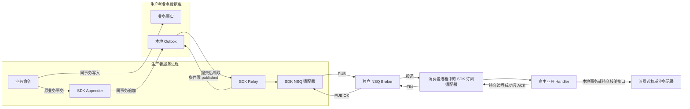
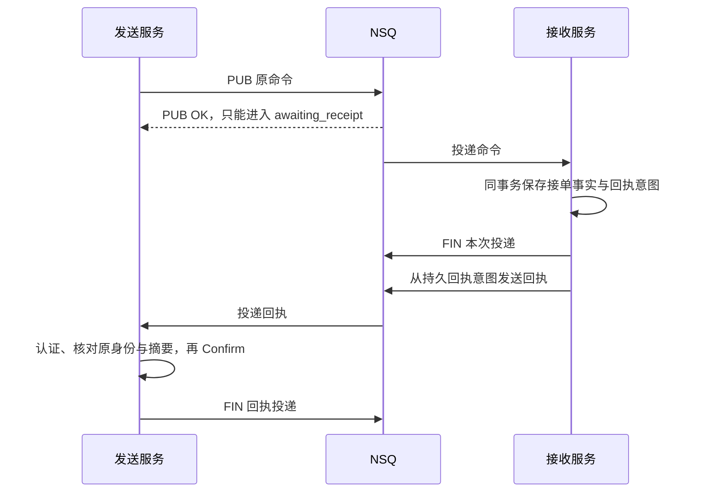

# 项目定位与架构

reliable-messaging 是供 IAM、qs-server、qs-ai 嵌入使用的消息 SDK。它把“保存发送意图、领取待发记录、发送、处理不确定结果、结算状态”的通用实现集中到一个仓库。各服务在自己的进程里调用它，Outbox 仍放在自己的业务数据库里；NSQ 则是独立运行的 Broker。

这套架构的核心是：**先用一笔本地事务保存业务事实和发送意图，再在事务外投递；允许同一消息重复到达，由接收服务用自己的业务记录识别重复。** 对需要证明“对方已经持久接单”的消息，还要等待业务回执，不能在 NSQ 接收消息后结束责任。

本文解释这条链路为什么这样设计、各部分如何协作，以及 IAM 和 QS 如何实际使用它。实现范围按当前源码核对；安装版本见[发布索引](../releases/README.md)。文中的跨仓案例固定源码提交，仅说明代码行为，不代表本次重新检查了生产。

## 为什么采用这个边界

### 从一次撤权看数据库与消息之间的空隙

假设 IAM 撤销某运营员的角色，需要让 QS 尽快丢弃旧权限缓存。这里有两个动作：IAM 保存授权变化，IAM 通知下游。这两个动作分别发生在 MySQL 和 NSQ，执行顺序本身不能消除故障窗口。

| 直接实现 | 中途退出会发生什么 | 对业务的影响 |
|---|---|---|
| 提交授权变化，再调用 NSQ | 数据库提交后、发送前进程退出 | 权限已经撤销，下游却可能仍使用旧缓存；数据库里没有待发任务可供恢复 |
| 先调用 NSQ，再提交授权变化 | NSQ 已接收，数据库事务回滚 | 下游收到一条没有对应新事实的通知；若消费代码直接执行事件中的动作，会产生错误效果 |
| 在数据库事务中调用 NSQ | 发送成功后，数据库仍可能回滚或提交结果未知 | 同时增加持锁时间和网络依赖，仍没有获得跨 MySQL/NSQ 的原子提交 |

SDK 的处理方式是在 **IAM 原事务** 中保存三件事：授权变化、新策略版本、这次版本变化的发送意图。三者共同提交或回滚。事务提交后，即使进程立刻退出，重启后的投递循环也能从本地 Outbox 找到未完成意图。

Outbox 的作用因此是把“提交后还需要做什么”变成可恢复的持久记录。它解决的是生产者这段本地一致性问题；后面的网络发送、Broker 故障和消费者执行仍各有自己的失败窗口。

### 为什么独立建 SDK，而保留各服务的本地 Outbox

IAM 和 QS 都需要重复维护领取、租约、发送结果分类、重投和状态结算。把这些规则抽取为 SDK，可以让一次修复同时被多个服务采用。

但若把 Outbox 搬进 SDK 自己的中央数据库，IAM 就需要分别提交“授权数据库”和“中央消息数据库”，重新出现跨库双写。因此，独立的是代码与版本发布，业务事实和 Outbox 保持同库、同事务。

这也是采用 SDK 的代价：每个宿主仍需迁移自己的表或集合，运行投递循环，设置重试预算和监控积压。SDK 可以减少相同机制的重复实现，无法替服务取消这些接入和运行责任。

## 主链路与事务边界

下面展示 Go 标准租约 Outbox 的链路。回执型 Outbox 的不同结算终点在后文单独说明。

图中包含三个分别结算的边界：

1. **生产者本地事务**：业务事实和 Outbox 意图一起持久化。Appender 使用宿主给定的原事务。
2. **发送及生产者状态写回**：NSQ 接收消息与 Outbox 标记 `published` 是两次操作，中间失败可能造成重投。
3. **消费及消费确认**：消费者业务提交与 FIN 是两次操作，中间失败可能造成再次消费。

没有一笔事务同时覆盖这三个边界。可靠性来自每段有持久依据、重复能够识别、不确定结果能够保留和恢复。它依赖宿主的数据库耐久性、消费者幂等和声明的故障恢复范围。

### 一条标准消息如何走完这条链路

**第一步：宿主确定这次业务事实的消息身份与内容。**

宿主提供 producer、message ID、destination、事件类型、schema、scope、发生时间和 payload；[message.New](../../message/message.go)校验字段、复制 payload 并计算指纹。标准存储以 `(producer, message_id, destination)` 区分投递意图。同身份、同内容再次追加可以幂等返回；同身份却改了内容会得到冲突，原记录不会被覆盖。

例如，重投某次版本变化通知，应继续使用那次事件的 ID 和内容。若每次重发都生成新 ID，接收方就难以区分“同一事件再次到达”和“新的业务事实”。消息指纹用于判断不可变内容是否一致，不用于认证发送者。

**第二步：在原业务事务中追加意图。**

MySQL 宿主把原 `*sql.Tx` 交给 [storage/mysql.Bind](../../storage/mysql/store.go)，或用 GORM 桥接原事务；Mongo 宿主把原活动 `SessionContext` 交给 [storage/mongo.Bind](../../storage/mongo/appender.go)。Appender 在这笔事务里写意图，既不另开业务事务，也不替宿主 Commit 或 Rollback。

追加失败必须向业务事务返回错误。如果业务写入成功而追加失败被吞掉，外层仍提交，Outbox 就失去了保证。可运行的[事务示例](../../examples/transactional-publisher/main.go)把业务行与 `rm_outbox` 行共同提交／回滚，Broker 调用没有出现在事务里。

**第三步：提交之后，投递循环发现这条意图。**

宿主启动 [relay.Run](../../relay/relay.go)。它周期调用 Store 扫描到期记录；可选的 Wake 只让提交后的扫描更快。Wake 丢失或服务重启不应丢任务，因为扫描依据是已提交的 Outbox，而不是内存信号。

租约 Store 为领取使用自己的短事务／原子操作。这个领取事务与第二步的业务事务不同，且不会一直持有数据库锁等待 NSQ。

**第四步：Store 领取，Relay 发送。**

[ClaimDue](../../outbox/store.go)将到期的 `pending/retry_wait` 或租约已过期的 `publishing` 记录领取为 `publishing`，返回新的 token、version 和租约截止时间。Relay 按有界批次发送，Publisher 返回三种结果：

| 结果 | 对这次发送已知的事实 | Relay 如何处理 |
|---|---|---|
| `Confirmed` | 适配器得到传输层接收确认 | 调用 Store.Confirm，条件写为 `published` |
| `Unknown` | 可能已送达，也可能未送达；例如超时、确认丢失或驱动报错 | 由宿主 RetryPolicy 决定延迟重投或隔离，保留原消息 |
| `Rejected` | 当前适配器在本地发现无效消息／路由等拒绝条件 | 同样交给宿主政策决定处理，不能一律无限重试 |

[NSQ Publisher](../../transport/nsq/publisher.go)在驱动 Publish 返回 nil 时报告 Confirmed。若调用方超时，底层发送仍可能完成，因此它返回 Unknown，并保留底层发送的并发名额直到真实调用退出。

这里还需要区分 **持久意图与网络编码**：基本 NSQ Publisher 发送 `Message.Payload`，不会自动把所有 Input 字段包进网络消息。宿主选择对应 wire 适配，把应用事件 ID 和必要元数据带到接收端；原业务 payload、传输 envelope 和 protected wire 的关系见[消息身份与协议](../01-核心设计/消息身份与协议.md)。

**第五步：用本次领取的资格写回状态。**

Store 只接受仍处于 `publishing`、token/version 匹配且租约有效的写回。设发送者 A 暂停过久，租约过期后 B 重新领取；此时 A 的迟到确认会被拒绝。这样可以阻止旧发送者覆盖 B 的状态。

这个保护不能收回 A 已经送往 NSQ 的消息，因此 B 的重新发送仍可能造成重复。**租约与条件写保护的是调度状态，消费幂等保护的是业务效果。** 两者不能互相替代。

**第六步：消费者完成自己声明的持久边界，再确认消费。**

[transport.Handler](../../transport/subscriber.go)由宿主实现；它解析事件、检查权限、调用业务服务、识别已处理事实。SDK 不会自动创建业务 Inbox，也不知道“生成报告”或“撤销权限”何时算成功。

普通 NSQ 订阅适配中，Handler 未显式结算时，返回 nil 会触发 ACK/FIN，返回错误会进入重投流程。宿主必须让这个返回值对应真实的持久业务边界，不能把“已放进一个内存队列”当成处理成功。达到技术失败预算后，SDK 提供失败中转；宿主仍需持久记录和治理失败，详见[投递与消费](../01-核心设计/投递与消费.md)。

## 用两个真实业务链路检验架构

### IAM：通知新版本，接收方回查授权事实

IAM 的版本变化事件只携带 `{"version": N}`，并不是一条让 QS 直接“删除某个用户角色”的命令。角色 Assignment 撤销、PolicyVersion 递增、事件追加发生在 IAM 同一原 GORM 事务里。

其 StandardStager 将事件映射为 Message，再绑定 SDK MySQL Appender。发布边界上的 PolicyWirePublisher 把原版本 payload 编为既有 Revision1 envelope，携带原事件 ID；SDK NSQ 适配器再投递。存储中的原业务 payload 与发送出去的 envelope 是两个明确层次。

接收方依靠版本推进和权威事实刷新：IAM 自身重载策略快照，QS 使旧权限缓存失效并重新核验 IAM。重复版本通知不应重复执行授权写入；较旧通知也不能把已经加载的新版本倒退回去。

这条链路说明两件事：

- SDK 复用的是原事务追加、发送和状态结算；Assignment、策略版本、快照加载、缓存失效与撤权时限是 IAM/QS 的业务职责。
- Outbox 为 `published` 只说明通知已被 NSQ 接收，不能证明每个服务实例已经换用了新权限。版本回查和新鲜度控制仍有必要。

源码定位见[宿主接入边界中的 IAM 地图](../02-接入指南/宿主接入边界.md#iam一次授权修改的责任链)，固定提交及本次更细的核对路径见文末。

### QS：先持久保存答卷，再异步建立 Assessment

这里以绑定了测评模型的答卷为例。QS 将答卷提交作为异步业务的起点。提交路径在 Mongo 同一原事务中保存 AnswerSheet、提交证据和相应 Outbox 意图。事务提交成功表示答卷已被持久接纳，评分和报告仍要在后续步骤完成。

API 进程的 Mongo Relay 把 `answersheet.submitted` 发往 NSQ。QS 在暂存前显式生成包含原事件 UUID、元数据和领域 JSON 的 Revision2 envelope，将完整 wire 保存为 Message.Payload；发送时复用这些字节。

Worker 接收事件后调用 API 的 `EnsureAssessment`；API 按原 answer_sheet_id 在 MySQL 查询或创建 Assessment，并推进提交。Worker 在接口成功后确认消费。这里的 ACK 表示 Assessment 接入成功，不能证明报告已经生成。

这里的业务幂等不是仅靠 Redis：Worker 的 Redis 重复抑制可以减少重复调用，但 Redis 出错时处理仍继续；Assessment 的业务回查和数据库唯一约束才是防止重复建立评估的持久依据。Worker 自己没有因为使用 SDK 而自动获得一个持久 Inbox。

假设 API 已创建 Assessment，但响应丢失或 Worker 在 FIN 前退出，消息可能再次到达。再次调用仍按同一个 answer_sheet_id 查找原 Assessment，继续原业务链路，而不是创建一个新测评。

Mongo 答卷提交与 MySQL Assessment 接入各自使用本地事务；MySQL 中创建 Assessment 和提交评估也可分步持久化，所以重投需要补提交已有的 pending 记录。SDK 用持久意图和幂等调用连接这些步骤，没有提供跨 Mongo、MySQL、NSQ 的统一提交。

若 Outbox 已 published 却没有 Assessment，QS 的 answersheetgap 扫描器会把它识别为 missing_confirmed，后续再核对原答卷、冻结配置、原消息和任何既存 Assessment，准备受控恢复；扫描本身不会自动重发。

这也说明效果恢复代码为什么还在 QS：只有它知道“缺少 Assessment”是否真实、是否存在已软删除的原结果，以及能否继续原业务。报告生成、Task 完成、未知模型调用和人工重试授权仍要在各自的业务链路中处理。

源码定位见[宿主接入边界中的 QS 地图](../02-接入指南/宿主接入边界.md#qsmongo-提交与-mysql-接单有独立事务边界)，固定调用路径见文末。

## 三种持久合同不能互换

前面的领取链路对应标准租约 Outbox。仓库还保留了两种不同用途的持久接口，它们的“完成”含义不相同。

| 实现 | 何时结束这条发送责任 | 由谁运行投递循环 | 选择它的理由 |
|---|---|---|---|
| Go 标准租约 Outbox：`outbox.Store`、`storage/mysql`、`storage/mongo` | 得到传输 Confirmed 后写为 `published` | 宿主启动 SDK Relay 并监督退出／重启 | 需要标准的到期扫描、多发送者领取、租约恢复；业务效果另由消费幂等及宿主对账保证 |
| 回执型 Outbox：`delivery/mysql`、Python `durable.py` | `requires_receipt=true` 时，必须核验原业务持久回执后写为 `confirmed` | 宿主提供扫描、发送和事务装配 | 命令或结果通知需要明确证明接收方已持久接受，PUB OK 不足以结案 |
| Python 原表适配：`sqlalchemy.py`、`deliver_durable`、`PeriodicRelay` | 宿主 callback 验证原 event_id 的持久接收后，把原行写为 `delivered` | 宿主显式运行原单进程循环／周期 Relay | 复用已有 JSON pending/delivered 表，不直接替换原存储和恢复合同 |

回执型 Outbox 不实现 `outbox.Store`；其 Pending 是查询待投记录，既不是租约领取，也没有 token/version fencing，不能直接接入通用 Relay。原事务 INSERT、扫描并发和结算装配由宿主控制。

回执型有一个容易误读的地方：其 `Published` 操作并不总是 Confirm。对需要回执的原消息，PUB OK 只进入 `awaiting_receipt`，到期仍可能重投同一原消息；只有宿主认证并核对原身份、内容摘要及阶段的业务回执才能 Confirm。

这条额外确认链可以这样理解：

FIN 结束的是一次 Broker delivery；业务回执回到原发送方，结束的是它等待对方持久接受的责任。若接单成功但回执丢失，原命令仍可能重投，接收方应复用原接单事实和回执，不能因此重新执行一次任务。

最后一条回执消息自身可以声明 `requires_receipt=false`，在 PUB OK 后结束；否则每条 ACK 再要求一条 ACK，会形成无限回执链。以持久接单为确认边界的命令，其回执不能证明模型已经执行完成；执行结果是宿主另行定义的阶段。

同名的 `Confirm` 尤其要按类型阅读：

- `outbox.Store.Confirm`：本次租约有效，记录传输发布确认。
- `delivery/mysql.Outbox.Confirm`：宿主已经认证并核对原业务回执，记录对方的持久接受。

Python 原表适配不具有 Go Store 的租约、token/version 或多进程 fencing 合同。共享消息身份和指纹也不意味着两个语言包具有对称 API；版本与拓扑前提见[Python 接入](../02-接入指南/Python接入.md)和[事务与 Outbox](../01-核心设计/事务与Outbox.md)。

## 失败后靠什么恢复

| 失败窗口 | 持久记录中留下什么 | 恢复依据与责任 |
|---|---|---|
| 业务／Appender 写入失败，原事务回滚 | 业务和意图都没有提交 | 宿主向调用方返回失败；不能仍宣称已经持久接单 |
| 原事务 Commit 返回不确定结果 | 业务事实与意图是否提交仍未知 | 宿主按原业务键和消息身份查证；不能假定回滚后重新生成 ID 或重复执行业务 |
| 事务已提交，尚未发送就退出 | 到期的本地 Outbox | 重启后周期扫描，继续发送原意图 |
| 已领取但发送者退出 | `publishing` 和租约 | 数据库时间到期后重新领取；已领取但未发出的行也可恢复 |
| NSQ 可能已接收，发送确认丢失 | 按政策写回的 `retry_wait`／`quarantined` 和 `publish_unknown` 错误码；写回失败则可能仍为 `publishing` | 按宿主政策延迟重投原身份／内容或隔离，消费者用业务记录识别重复 |
| PUB OK，确认尚未持久写回就退出 | 尚未结算的原意图 | 租约到期再发；需要容忍重复，不能凭内存结果跳过持久结算 |
| 已写 `published`，随后 Broker 丢失未消费的消息 | 传输确认事实，但没有业务效果证据 | pending 扫描不会重新发现这行；宿主需要版本回查、业务对账或回执型责任，不能把所有 published 无条件重发 |
| 消费业务已经提交，FIN 丢失 | 消费者权威业务记录 | Broker 再投，业务处理查询原结果／原接单记录后确认，不重复产生副作用 |
| 模型调用已经发出，结果未知 | 原任务、冻结配置与调用回执 | qs-ai 按原执行恢复规则核对，不能把消息重投许可解释成再次调用模型的许可 |

“已写 published 后 Broker 丢失消息”是采用现有 NSQ 时必须认识的边界。SDK 的 `Confirmed` 来自协议接受确认，不能证明消息已同步刷盘或消费者完成。仓库的[隔离 Broker 崩溃脚本](../../scripts/integration.sh)专门检查了内存队列在强杀后的已确认消息丢失场景；这是故障边界的刻画，不能称为该场景下可靠恢复通过。

因此，选择 NSQ 的同时必须为每条业务流明确效果恢复来源。IAM 可以以策略版本和授权事实回查；QS 必须按相应答卷、Assessment、报告或回执合同对账。更换 Broker 可以改变传输耐久性和运维成本，但不会把原数据库事务与发送操作自动变成一笔事务。

## 职责分工

判定某段代码是否应该搬进 SDK，可以问：**换一个业务服务后，这段代码所维护的不变量是否仍完全相同？**

| 要维护的规则 | SDK 中的通用部分 | 宿主保留的部分，以及原因 |
|---|---|---|
| 身份不能在重投时变化 | Message 校验、指纹、不可变 payload、同身份冲突检测 | 事件 ID 的生成、业务 schema、scope 和目的地；它们取决于服务自己的事实模型 |
| 发送者不能覆盖别人的领取状态 | 到期领取、数据库时间、token/version 条件写、状态操作 | 表／索引迁移、数据库连接、技术预算、隔离后的治理入口 |
| 不确定发送不能被误报为成功 | Publisher 结果分类、并发限制、排空行为 | 哪些拒绝可重试、告警阈值、原意图保留期限和人工恢复授权 |
| Broker 重复投递不能造成重复效果 | Delivery 单次结算、NSQ 重投与失败中转机制 | 按 answer_sheet_id、策略版本或原任务判断已处理；SDK 不认识这些业务对象 |
| 业务回执要对应原消息 | 回执型表的身份／摘要匹配和状态操作 | 认证发送者、校验回执阶段、与业务接单／结果共同提交，决定允许哪类业务重试 |

例如，租约到期的通用重领规则可以跨 IAM/QS 共享；`EnsureAssessment` 的“原答卷是否已经对应一个 Assessment”规则只能由 QS 维护。相同机制已经集中后，宿主仍会有事件适配、事务调用和业务消费代码，接入行数也不会自动降为零。

### 代码组织

下表按调用职责分组，适合从运行链路反查代码。

| 组 | 源码入口 | 如何参与链路 |
|---|---|---|
| 消息与本地意图 | [message](../../message/message.go)、[outbox](../../outbox/store.go)、[MySQL](../../storage/mysql/store.go)、[Mongo](../../storage/mongo/appender.go) | 确定原消息，使用宿主原事务追加；提交后提供标准领取／结算 |
| 标准出站 | [relay](../../relay/relay.go)、[transport](../../transport/publisher.go)、[NSQ Publisher](../../transport/nsq/publisher.go) | 以 Store 和 Publisher 为接缝调度，按发布结果与宿主政策结算 |
| 消费和失败中转 | [Delivery/Handler](../../transport/subscriber.go)、[NSQ Subscription](../../transport/nsq/subscription.go)、[Subscriber](../../transport/nsq/subscriber.go) | 将物理投递交给业务 Handler，执行 FIN/REQ 与技术失败中转 |
| 回执型出站 | [delivery/mysql](../../delivery/mysql/outbox.go)、[Python durable](../../python/src/reliable_messaging/durable.py) | 与标准 Relay 分开；保留 body/wire/hash 和等待原业务回执的状态 |
| 事件目录与 wire | [catalog](../../catalog/catalog.go)、[domain](../../wire/domain/envelope.go)、[legacy](../../wire/legacy/envelope.go)、[protected](../../wire/protected/protected.go) | 查询宿主路由／可靠性分类，编码领域正文、传输信封或安全 wire；目录标签本身不会自动开启事务 |
| 即时提示 | [signaling](../../signaling/signal.go)、[Redis](../../signaling/redis/signaler.go) | 提供可丢失的通知，缩短持久扫描或权威回查的延迟；不替代 Outbox |
| Python 包 | [reliable_messaging](../../python/src/reliable_messaging/__init__.py) | 独立分发消息身份、原事务追加、持久接收结算及可选 NSQ 扩展 |

安全 wire 负责认证、加密和上下文绑定，不能替代本地持久意图；Redis 提示负责及时唤醒，不能替代业务事实。两者是链路上的不同能力，启用时分别满足其前提，详见[安全与大消息](../01-核心设计/安全与大消息.md)。

SDK 不依赖 IAM、QS、qs-ai 或 component-base；数据库／Broker 驱动留在适配边界，[架构测试](../../tests/architecture/imports_test.go)检查这些依赖。这样维护通用机制时，不需要把宿主领域对象一并带进库。

## 选择带来的收益与代价

独立 SDK 让消息技术机制有一个修复和发版入口，各宿主固定版本接入。原数据库和业务事务保持本地归属，能够保留 IAM 的版本回查、QS 的答卷与 Assessment 幂等、qs-ai 的持久回执与冻结配置恢复。

运行上，宿主的装配顺序是：先显式安装 schema／索引，准备数据库池和 Broker 路由，再构造 Store、Publisher、Relay 并提供 RetryPolicy 与 Observer，最后显式启动 Relay／订阅。停止时先关业务入口，再等待已接纳的处理与发送退出，最后关闭资源。

宿主还要监督 Relay：扫描数据库出错时 `Run` 会返回错误，SDK 没有自动无限重启的后台 Supervisor。普通绑定和 Relay 构造不隐式建表、发送或运行后台循环；`NewManagedPublisher` 是明确会连接并 Ping NSQ、持有自身 Producer 的入口，见[生命周期与恢复](../01-核心设计/生命周期与恢复.md)。

这意味着 reliable-messaging 不需要单独部署，也不需要自己的 MySQL、MongoDB 或 Redis。服务只为启用的适配器提供资源：Go MySQL Outbox 使用本服务 MySQL；Mongo Outbox 使用本服务支持事务的 Mongo；Redis signaling 是可选资源。NSQ 是另一个独立运维对象，其部署与故障域没有被 SDK 消除。

后续抽取代码应围绕已经证明共同的规则继续推进。业务权限、工作流、模型执行、候选评测和未知副作用恢复没有通用到可以由消息 SDK 接管的相同合同，不应仅因为它们出现在消息 Handler 中就迁入。

## 阅读与核验入口

本篇提供整体链路。继续理解实现时，建议按以下问题阅读：

1. “同一条消息”由什么字段确定，业务正文如何变成 wire？见[消息身份与协议](../01-核心设计/消息身份与协议.md)。
2. 原事务怎样绑定，表中的状态、租约与时间到底表示什么？见[事务与 Outbox](../01-核心设计/事务与Outbox.md)。
3. PUB、FIN 和业务回执分别确认什么，重复与失败中转怎样处理？见[投递与消费](../01-核心设计/投递与消费.md)。
4. 如何装配并验证宿主接入？见[Go 接入](../02-接入指南/Go接入.md)、[Python 接入](../02-接入指南/Python接入.md)及[宿主接入边界](../02-接入指南/宿主接入边界.md)。

### 源码核对与验证范围

本篇在 2026-10-06（UTC+8）核对 SDK 文档重写基线 `a62e905`。下列隔离测试定位事务、崩溃和重复的技术合同；它们使用专用资源或测试消费者，不能替具体宿主证明全链路已经上线验收。

| 本篇的关键判断 | 可复核的实现／测试 |
|---|---|
| 业务和意图在原事务共同提交或回滚 | [公开事务示例](../../examples/transactional-publisher/main.go)、[MySQL 原事务测试](../../tests/integration/mysql_test.go)、[Mongo 原事务与重入测试](../../tests/integration/mongo_test.go) |
| 提交后唤醒丢失，周期扫描仍能发现记录 | [Relay 测试](../../relay/relay_test.go)的 `TestMissedPostCommitWakeStillUsesPeriodicScan` |
| 领取后退出、发送后写回前退出会恢复并可能重复 | [进程崩溃测试](../../tests/integration/crash_test.go)的 `TestRelayProcessCrashRecovery` |
| 旧发送者不能覆盖已经重新领取的记录 | [迟到领取测试](../../tests/integration/late_relay_test.go)的 `TestLateRelayCannotOverwriteRecoveredClaim` |
| 发送超时仍需等待底层调用，且不能报告确定失败 | [NSQ Publisher 测试](../../transport/nsq/publisher_test.go)的 `TestTimeoutRetainsBoundedSlotAndDrain` |
| 需要业务回执时，PUB OK 不能 Confirm | [Go 回执型操作](../../delivery/mysql/outbox.go)、[Python 回执型实库测试](../../python/tests/test_durable_mysql.py) |
| Broker 接受确认不覆盖强杀后的内存消息丢失 | [隔离执行脚本](../../scripts/integration.sh)及[Broker 断点探针](../../tests/integration/brokerrestart/main.go) |

跨仓业务案例核对 IAM `c8fc1fe61a32056368148e232e96d32763c15ba5`、QS `2ccc2de44bbd45e26d29e7e130da518cc32426f0`；具体提交路径见[宿主接入边界](../02-接入指南/宿主接入边界.md)。以下是本篇例子的额外调用定位，保持固定提交以便以后复核：

- [IAM 发布前 wire 适配](https://github.com/FangcunMount/iam/blob/c8fc1fe61a32056368148e232e96d32763c15ba5/internal/apiserver/infra/messaging/policy_wire_publisher.go)：原版本 payload 到 Revision1 envelope，不覆盖持久意图。
- [IAM Assignment 命令的 commit](https://github.com/FangcunMount/iam/blob/c8fc1fe61a32056368148e232e96d32763c15ba5/internal/apiserver/application/authz/assignment/command_service.go#L327)：原事务内依次修改 Assignment、递增版本、Stage，提交后重载本地策略。
- [QS 授权版本消费](https://github.com/FangcunMount/qs-server/blob/2ccc2de44bbd45e26d29e7e130da518cc32426f0/internal/pkg/iamauth/version_sync.go#L74)与[权限快照加载](https://github.com/FangcunMount/qs-server/blob/2ccc2de44bbd45e26d29e7e130da518cc32426f0/internal/pkg/iamauth/snapshot_loader.go#L142)：版本推进、缓存失效及后续权威权限读取。
- [QS CreateDurably](https://github.com/FangcunMount/qs-server/blob/2ccc2de44bbd45e26d29e7e130da518cc32426f0/internal/apiserver/application/survey/answersheet/transactional_durable_store.go#L37)与[首次 wire 编码](https://github.com/FangcunMount/qs-server/blob/2ccc2de44bbd45e26d29e7e130da518cc32426f0/internal/apiserver/eventing/standardoutbox/wire.go#L12)：Mongo 原事务保存与原事件字节准备。
- [QS Worker 的 EnsureAssessment 调用](https://github.com/FangcunMount/qs-server/blob/2ccc2de44bbd45e26d29e7e130da518cc32426f0/internal/worker/handlers/answersheet_handler.go#L319)与[API 的原答卷回查](https://github.com/FangcunMount/qs-server/blob/2ccc2de44bbd45e26d29e7e130da518cc32426f0/internal/apiserver/application/journey/assessmentintake/service.go#L176)：按业务唯一身份建立／恢复 Assessment。
- [QS 跨库效果扫描](https://github.com/FangcunMount/qs-server/blob/2ccc2de44bbd45e26d29e7e130da518cc32426f0/internal/apiserver/infra/answersheetgap/scanner.go#L199)与[原消息恢复计划](https://github.com/FangcunMount/qs-server/blob/2ccc2de44bbd45e26d29e7e130da518cc32426f0/internal/apiserver/infra/answersheetgap/recovery.go#L51)：核对业务缺口和原恢复证据，不自动授权重发。
