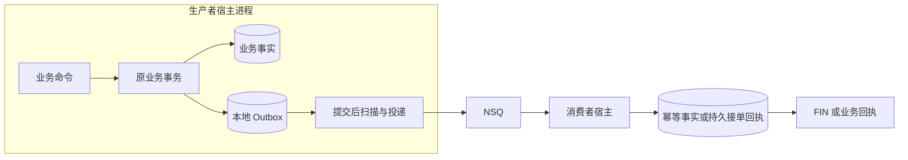

# 项目定位与架构

本文回答 reliable-messaging 为什么存在、承载哪些通用职责，以及 SDK、宿主和 Broker 如何分工。范围为当前 Go 和 Python 源码；可安装制品及其支持范围以[版本索引](../releases/README.md)为准，源码存在不等于已发布或宿主已验收。

reliable-messaging 是嵌入宿主进程的消息 SDK。它将身份、持久意图、投递结算、NSQ 发布订阅、编码和提示机制集中维护，让 IAM、qs-server、qs-ai 复用同一组技术合同。业务事实与消息意图仍保存在宿主原数据库、原事务中； SDK 不建立中央消息数据库，也不运行独立消息服务。

## 为什么采用这个边界

业务写入与 Broker 发送是两个独立系统的操作。直接“提交数据库后发送”可能在提交后崩溃而丢失发送机会；先发送再提交则可能发布最终回滚的业务。当前方案让业务事实与持久意图原子提交，再从已提交意图投递。这个选择把不确定窗口变成可查、可恢复的记录，而没有让数据库与 Broker 获得同一个事务。

抽取的是跨服务相同的技术机制。具体事件、权限、消费效果和重试许可仍由服务维护。例如 SDK 可以重新投递原事件，却不能判断某次模型调用是否发生、是否安全再次执行。若把这些判断移入 SDK，就会引入宿主领域依赖，也无法保持各服务已有回执和冻结配置语义。

## 主链路与事务边界

图中的生产者数据库事务只包含业务事实和本地意图。Broker 发布、消费者数据库提交和回执传输各有失败窗口，必须分别结算。需要业务持久回执的流，在发布确认后仍保留待回执责任；只采用标准租约 Outbox 的流，`published` 仅表示发布确认。

## 职责分工

| 层 | 负责 | 必须由其他层提供 |
|---|---|---|
| SDK | 通用消息身份与字节合同、原事务绑定、存储结算、受监督 Relay、NSQ 适配、失败中转、wire、安全封装、Redis 提示 | 事件语义、实际路由、原数据库及事务、业务处理回调、重试政策、密钥与运行参数 |
| 宿主 | 业务写入、表和索引迁移、资源装配、消费幂等、持久接单、业务授权、未知副作用核验、监控阈值与发布回退 | SDK 的技术合同和 Broker 的实际能力 |
| Broker | 消息传输、topic/channel、物理投递与 FIN/REQ | 本地业务原子性、业务幂等、最终效果证明 |

宿主可选择借用 Producer，也可让明确的 ManagedPublisher 入口持有 Producer。两种方式都不改变数据库或业务责任归属。SDK 构造器不会隐式建表或启动 Relay；`NewManagedPublisher` 明确连接并 Ping NSQ，其网络行为及关闭职责见[生命周期与恢复](../01-核心设计/生命周期与恢复.md)。

## 代码组织

| 目录 | 设计角色 |
|---|---|
| `message/` | 不可变意图及跨语言指纹 |
| `outbox/`、`storage/mysql/`、`storage/mongo/` | 租约领取与栅栏结算；MySQL/Mongo 适配隔离驱动细节 |
| `relay/`、`transport/`、`transport/nsq/` | 发布结果、扫描调度、发布订阅和失败中转 |
| `delivery/mysql/` | 与租约 Store 分离的业务回执型 Outbox 原事务操作 |
| `catalog/` | 宿主事件到 topic 的目录与可靠性分类 |
| `wire/domain/`、`wire/legacy/`、`wire/protected/` | 领域 JSON、传输编码、安全封装与尺寸检查 |
| `signaling/`、`signaling/redis/` | 可丢失的即时提示，不承担可靠持久化 |
| `python/src/reliable_messaging/` | 独立 Python 分发：身份、原事务、回执结算及相应扩展 |

公开合同不依赖 IAM、QS、AI 或 component-base。驱动依赖留在适配包；宿主可以复用核心抽象而不把自身领域类型搬进 SDK。实际依赖边界由[架构测试](../../tests/architecture/imports_test.go)检查。

## 三种持久合同不能互换

| 合同 | 结算含义 | 适用边界 |
|---|---|---|
| Go 租约 Outbox | `published` 为传输确认 | 有租约、token/version 栅栏；消费者效果由宿主核验 |
| 业务回执型 Outbox | `requires_receipt=true` 等待认证后的业务持久回执 | Go/Python 各有原事务操作；宿主负责扫描、原顺序及持久失败预算 |
| Python 原表适配 | 原 `pending/delivered` 表按业务回执 callback 结算 | 最小核心面向原单进程循环，无 Go 租约 Store 的多进程合同 |

共享身份和编码不意味着所有 API、表结构或拓扑能力相同。Python 的最小核心与可选 NSQ 扩展、Go 固有线与后续 MQ 扩展，按各自版本核验；详见[事务与 Outbox](../01-核心设计/事务与Outbox.md)和[Python 接入](../02-接入指南/Python接入.md)。

## 选择带来的收益与代价

SDK 统一维护相同的发送分类、存储栅栏、编码和关闭行为，减少多仓复制；宿主仍需要事务接缝、领域处理和恢复授权代码。这些代码是业务边界，而不是全部可以消除的重复实现。没有中央数据库，减少了一次跨库双写和独立平台运维；相应地，每个宿主仍要安装本地表／索引、运行自己的扫描循环并监控积压。

当前 Go Broker 适配为 NSQ。发布确认不承诺消费者完成或同步磁盘持久化；已有隔离强杀测试揭示内存队列下的丢失边界。需要效果恢复时必须依靠宿主事实、业务回执或审计，不能仅看 `published`。更换 Broker 仍需重新核验确认、拓扑、重复投递和故障域，不自动解决 MySQL 双写。

SDK 不接管模型重试、工作流、候选评测、业务权限或生产配置。向 SDK 增加新职责，应先证明它在多个宿主中具备相同的不变量，并补充版本、数据与故障验证。

## 阅读与核验入口

- [消息身份与协议](../01-核心设计/消息身份与协议.md)：身份、原字节与多层 wire。
- [事务与 Outbox](../01-核心设计/事务与Outbox.md)：三种存储合同及事务前提。
- [投递与消费](../01-核心设计/投递与消费.md)：三种确认、幂等与失败中转。
- [工程约束](../../AGENTS.md)、[核心消息](../../message/message.go)、[Store 合同](../../outbox/store.go)、[Relay](../../relay/relay.go)。
- [测试与故障验证](../03-维护与验证/测试与故障验证.md)：源码、隔离证明、发布和宿主验收各自能证明什么。
