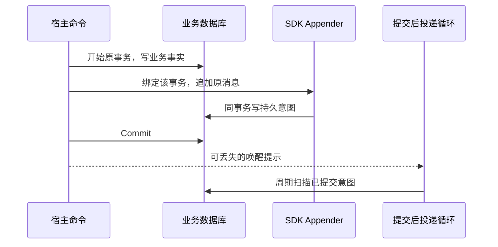
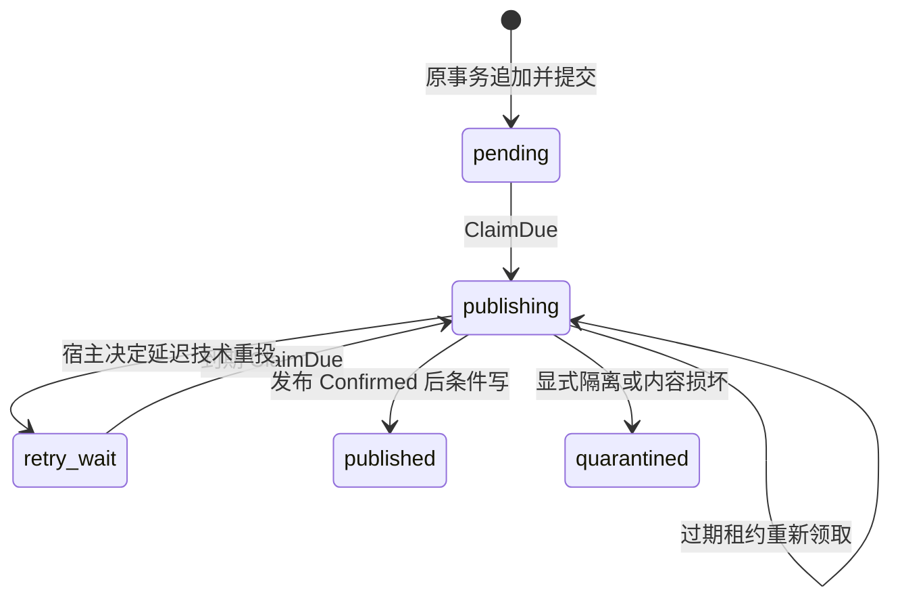
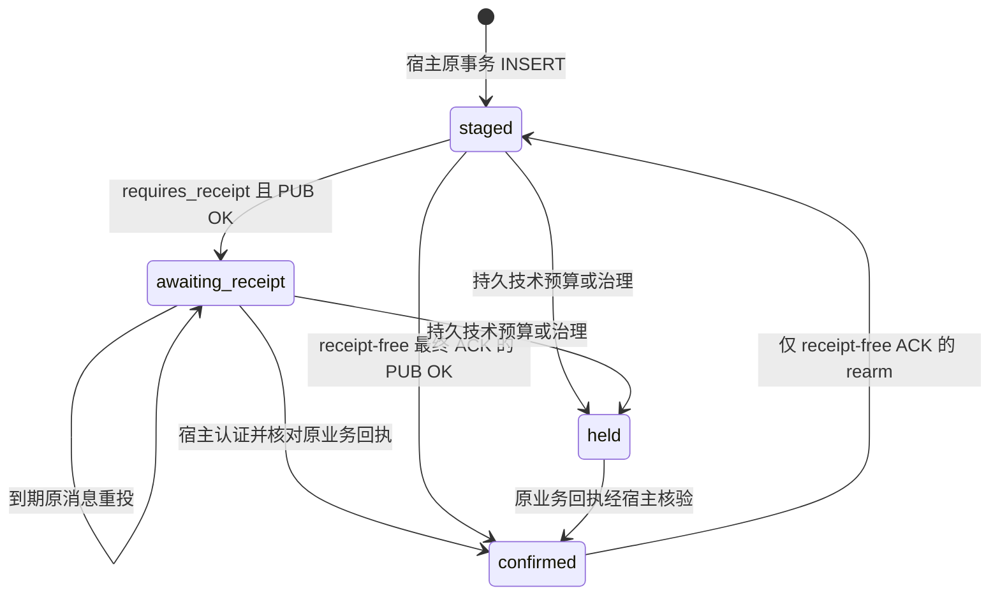

# 事务与 Outbox

本文回答业务事实与消息意图如何原子提交、三种持久合同如何选择，以及领取／结算怎样拒绝迟到写入。范围为当前 Go/Python 实现；表结构与公开制品的对应条件见[兼容与升级](../03-维护与验证/兼容与升级.md)。

Outbox 必须与业务事实使用宿主原数据库、原事务。SDK 借用该事务追加，不另开业务事务、提交、回滚或自动建表。事务提交后的发送仍可能重复或丢失确认；持久意图让这个窗口可恢复，不把数据库和 Broker 合成一个原子操作。

## 正常写入链路

业务事务内不执行 Broker PUB。追加失败由宿主回滚；若 Commit 返回未知，宿主按原业务身份和持久记录核验结果，不能重新生成消息或假定一定回滚。唤醒只缩短扫描延迟，丢失后仍由周期扫描发现已提交记录。

## 原事务绑定的不同前提

| 适配器 | 绑定要求 | 宿主责任与限制 |
|---|---|---|
| Go MySQL | 原 `*sql.Tx`；`Bind` 不 Begin/Commit | nil 拒绝，已结束事务的写入由 database/sql 失败；追加错误必须回滚 |
| Go GORM | 从原 GORM 事务提取受支持 `*sql.Tx`，含已识别 PreparedStmtTX | 普通 DB 和未知 wrapper 拒绝；升级 GORM 重验桥接 |
| Go Mongo | 同 client collection 与活动 `SessionContext` | SessionContext 本身不够；当前驱动 v1 的活动状态桥接须保持验证；同一 session 不并发使用 |
| Python SQLAlchemy | 原 AsyncSession/AsyncConnection 的活动事务及原 savepoint | append 不隐式 begin；校验实际 MySQL 驱动 non-autocommit，未知校验方法拒绝；宿主提交／回滚 |

Mongo `WithTransaction` callback 可以重入。原身份和原 bytes 在 callback 外准备，每次调用内重新 bind。未知提交测试区分“重试 commit”与“重新运行业务 callback”，不能将两者混作业务重试。Python binding 不能跨原事务或 savepoint 生命周期复用；ORM 的逻辑 begin 也不能代替真实 non-autocommit 校验。

## 三种持久合同

| 合同 | 数据形状与调度 | 结算对象 |
|---|---|---|
| Go 标准租约 Outbox | `rm_outbox`／标准 Mongo 文档，claim token/version/lease | Broker 发布确认 |
| 回执型 Outbox | 宿主命名的独立表，body/wire/hash、aggregate sequence、requires_receipt | 按行合同等待业务回执或结束 receipt-free ACK |
| Python 原表适配 | 原 event_id/payload/delivered/attempts/available_at 表 | callback 验证的原 event_id 业务持久回执 |

第三项是最小核心对已有单进程循环的适配，无 Go Store 租约或多进程 fencing 合同。第二项不实现第一项的 `outbox.Store`，也不会自动启动通用 Relay。宿主仍提供扫描与事务装配，不能仅因两者都叫 Outbox 而替换表或调度器。

## 租约 Outbox 状态与并发保护

Store 以数据库时钟领取到期行和过期租约，每次领取更新 token/version。结算必须匹配记录、`publishing` 状态、token、version 和尚有效的租约；旧执行者即使迟到收到 PUB OK，也不能覆盖新领取者的状态。RecordID 对 Relay 不透明，不能跨 SQL/Mongo 重造或解析。

MySQL 用短领取事务与行锁；Mongo 逐条原子 FindOneAndUpdate。批量领取中断可能留下已经领取但尚未投递的行，它们由租约恢复。没有租约续期合同；配置必须使 lease 覆盖 publish 与 write 超时。失效 claim 返回 `ErrStaleClaim`，不是消息内容丢失。

`attempt_count` 统计领取，包括过期回收；`failure_count` 只统计成功栅栏下的 Retry/Quarantine，包含不可变内容损坏隔离。两者都不代表消费者业务执行次数。`published` 保存传输确认事实，不能据此推断所有消费者完成或删除未核验的业务责任。

## 回执型 Outbox 状态与顺序

本表采用原身份加 body hash 核对、原事务锁定与状态结算。Published/Retry 的迟到回调不能把 `confirmed` 或 `held` 改回待投；合法业务回执核验与技术发布回调是不同入口。`rearm_ack` 只重排同一 receipt-free ACK，不能重排业务执行消息，也不能解除持久 held。

有序行用宿主持久的 aggregate_key/aggregate_sequence 检查较早未 confirmed 行；顺序以原业务决策序列为准，不能用 available_at、重投时间或 NSQ ID 推导。held 的较早有序行仍阻挡后续决策。这保证的是声明聚合内的结算约束，不是 NSQ 全局顺序，也不是等待模型执行完成的工作流。

## schema、索引和时间

SDK 的 [MySQL 标准 DDL](../../storage/mysql/schema.sql)、[Mongo 索引定义](../../storage/mongo/store.go)及[回执表参考 DDL](../../delivery/mysql/schema.sql)是合同来源，宿主负责命名、迁移、耐久性设置和容量检查。`CREATE TABLE IF NOT EXISTS` 不升级旧表；可选原行重排另需审计列和宿主审批账本。

标准 MySQL 调度 DATETIME(6) 存显式 UTC 时钟数字；适配器用 UTC 字符串避免驱动 loc 二次转换。Mongo 调度保存绝对时刻，领取与重试使用 `$$NOW`；其追加 created_at 是宿主 UTC 诊断时间，不参与租约和排序。业务和运维可显示 UTC+8，但不得批量平移历史 DATETIME 或改写原 occurred_at。Python 原表和回执表以 UTC_TIMESTAMP(6) 调度；旧表转换须单独审计。

## 失败窗口与取舍

| 窗口 | 保证与后续责任 |
|---|---|
| 追加失败／事务回滚 | 业务与意图一起回滚；宿主不得仍报告已持久接单 |
| 提交成功，唤醒丢失或进程退出 | 意图留在本地；周期扫描恢复 |
| PUB 成功，结算写失败 | 意图可能再次发送；消费者必须按原身份幂等 |
| 旧执行者迟到结算 | 租约型 Store 拒绝旧 claim；回执型表按行合同保留已确认／held 状态 |
| 原身份内容冲突 | 不覆盖原意图；宿主回滚并治理 |

本地表增加了 schema 和积压维护成本；它保留了与业务事实同事务的恢复依据。共享 SDK 统一技术合同，而不能取消宿主对表迁移、原事务和业务效果的责任。

## 源码与验证

源码：[MySQL Appender/Store](../../storage/mysql/store.go)、[GORM 桥接](../../storage/mysql/gorm.go)、[Mongo Appender](../../storage/mongo/appender.go)、[Store 合同](../../outbox/store.go)、[回执型 Go 操作](../../delivery/mysql/outbox.go)、[SQLAlchemy 绑定](../../python/src/reliable_messaging/sqlalchemy.py)、[Python 回执表](../../python/src/reliable_messaging/durable.py)。

验证：[MySQL 原事务与栅栏](../../tests/integration/mysql_test.go)、[Mongo 重入与未知提交](../../tests/integration/mongo_test.go)、[时间组合](../../tests/integration/mysql_timezone_test.go)、[迟到 claim](../../tests/integration/late_relay_test.go)、[Python 原事务](../../python/tests/test_mysql.py)、[回执型实库测试](../../python/tests/test_durable_mysql.py)。这些用例不能代替具体宿主历史数据迁移与生产回退验收。
