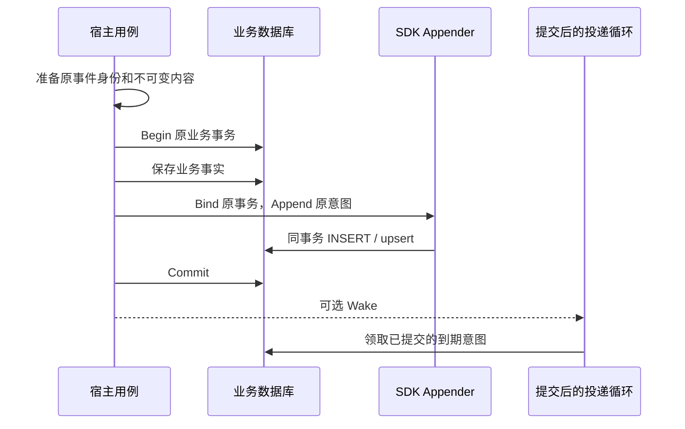
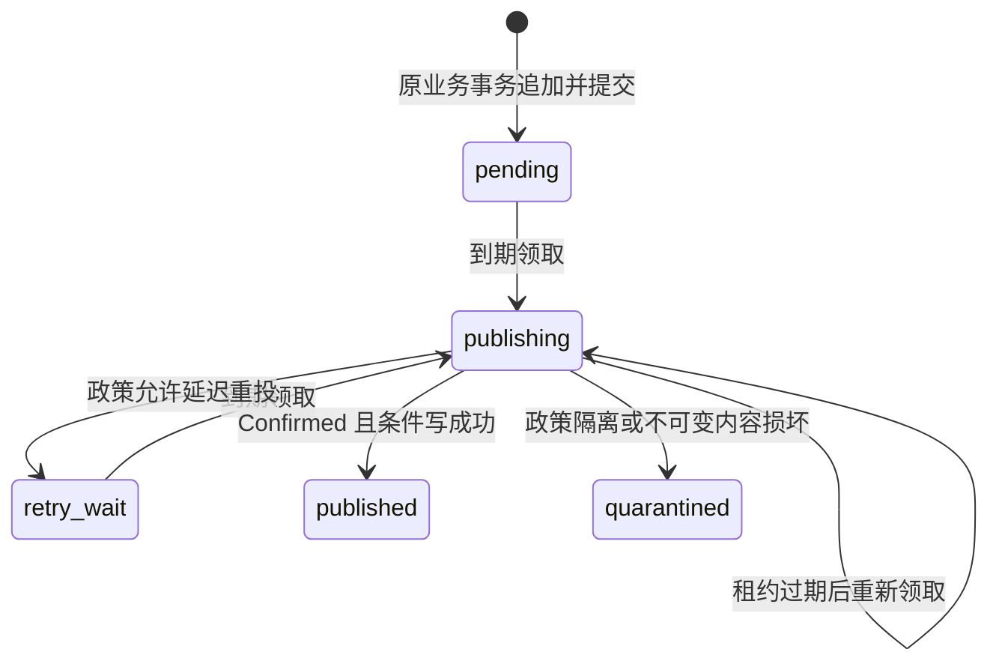
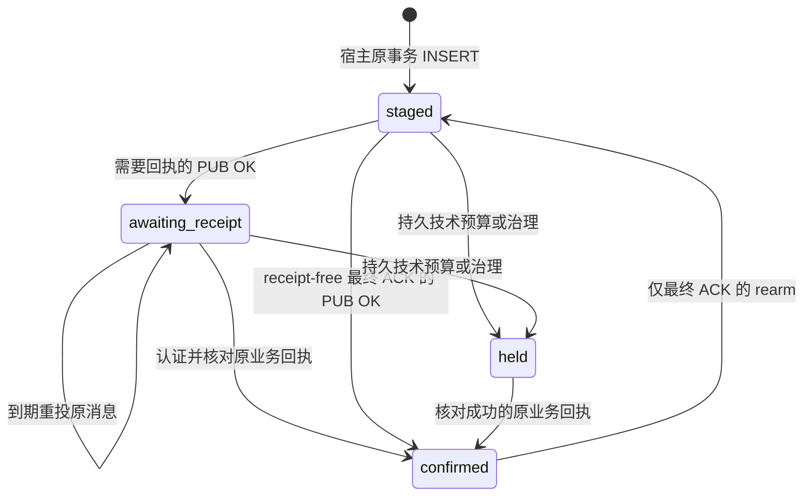

# 事务与 Outbox

本篇解释发送意图怎样与业务事实一起提交，以及提交之后如何领取、重投和结算。**业务事务负责“有没有这条意图”；标准租约 Store 负责“当前谁有资格发送与写回”；消费者或业务回执负责“对方是否已经持久接受”。** 三者的状态不能混用。

仓库提供 Go 标准租约 Outbox、Go/Python 回执型 Outbox、Python 原 pending/delivered 表适配。它们服务于不同接入边界，没有一张表同时实现全部合同。本文按当前源码解释，制品与宿主依赖见[版本索引](../releases/README.md)。

## 正常写入链路

以 IAM 的策略版本变化为例，某次授权变更应产生一个固定事件：原版本推进到 N，事件 ID 为 E。宿主必须在同一业务事务中保存授权变化、版本 N 和事件 E 的投递意图。若意图追加失败，业务事务也不能提交；否则“已撤权但没有发送责任”的空隙仍然存在。

可执行的[MySQL 事务示例](../../examples/transactional-publisher/main.go)就是这条结构：宿主 BeginTx，插入业务行，Bind 原 tx 并 Append，最后由宿主 Commit。回滚时业务行和意图都不存在，提交时两者都存在。SDK 不替用例决定业务成功响应，也不在这笔事务里调用 Broker。

同一个连接池上的两次独立提交不算同事务。保存点也必须正确使用：若业务写在外层、意图写在内层保存点，单独回滚内层却继续提交业务，同样会留下没有意图的事实。

这里有三个必须分开的失败结果：

- **追加或其他业务写入失败**：宿主回滚整笔事务，不能把业务行单独提交。
- **提交成功，Wake 丢失**：意图已经存在，后续周期扫描继续发现它；Wake 只缩短等待。
- **Commit 的结果未知**：网络错误不能证明数据库已经回滚。宿主按原业务幂等键和原事件身份查证，未确认之前保留不确定状态，不重新生成事件 ID 再执行一次业务。

Outbox 必须在业务事实所在的原数据库中。中央 Outbox 数据库、另一条连接上的独立事务，或“业务提交后再补写 Outbox”都无法提供上述共同提交保证。整体理由见[项目定位与架构](../00-总览/项目定位与架构.md)。

## 原事务绑定的不同前提

“拿到一个数据库对象”不等于“绑定了业务刚才使用的事务”。各语言与驱动的绑定都围绕这个区别设计。

| 入口 | 实际绑定什么 | 容易接错的对象与行为 |
|---|---|---|
| Go `storage/mysql.Bind(tx)` | 宿主给定的原 `*sql.Tx` | 普通 `*sql.DB` 不是事务；nil 被拒绝；已结束 tx 的写入由 database/sql 报错 |
| Go `BindGORM(tx)` | 原 GORM Statement.ConnPool 暴露的受支持 `*sql.Tx` | 普通 DB、未知 wrapper 不能降级为池写入；已识别 PreparedStmtTX 可拆到原 tx |
| Go Mongo `Bind(sessionCtx, collection)` | callback 中活动的原 Mongo 事务 | 只有 SessionContext 还不够；必须是活动事务，collection 也应来自同一个 client |
| Python `bind(db)` | 原 AsyncSession/AsyncConnection 的活动事务与当时的 savepoint | 普通 session、已完成或换过的事务、变化的 savepoint、驱动 AUTOCOMMIT 均不满足合同 |

### MySQL/GORM：使用原 tx，追加错误交还用例

[Go Appender](../../storage/mysql/store.go)只在借入的 tx 上执行 INSERT。同身份冲突检测也用这个 tx 查询指纹，遇到不同内容返回 `outbox.ErrConflict`。这不是让 SDK 自行结束事务的错误处理入口；外层必须把错误向上传递并回滚。

[BindGORM](../../storage/mysql/gorm.go)不是任意 ORM 的通用包装。当前桥接明确识别原 `*sql.Tx` 和 GORM PreparedStmtTX；未知连接包装拒绝接入，而不是退回普通连接执行 SQL。升级 GORM 后，需要重新验证桥接是否仍取到原事务。

SDK 的 Store 后续会开一个领取短事务，见后文。**“不另开业务事务”不等于 SDK 从不调用 BeginTx**：业务写入由原 tx 承担，提交后的领取是另一个职责。

### Mongo：callback 重入不能改变原消息

Mongo WithTransaction 的 callback 可能因为可重试事务错误再次执行。原事件 ID、发生时间和 payload 应在 callback 外准备；每次 callback 内重新 Bind 当前活动事务，再保存业务事实与 Append 原消息。

若把“生成 UUID”“读取当前配置”“重新计算当前时间”放进 callback，每次执行就可能产生不同意图，甚至使用与首次不同的配置。技术重试不应该制造新的业务事件或改变冻结事实。

[Mongo Appender](../../storage/mongo/appender.go)使用原 SessionContext upsert 标准文档，不自行开始或重试事务。当前驱动 v1 缺少稳定公开的活动事务查询 API，适配器使用固定版本桥接检查；这项依赖留在适配包，由真实事务测试验证。检查确认当前 session 有活动事务，没有锚定事务编号；宿主应每次 callback 重新绑定，不跨事务复用 Appender。同一个 Mongo session 不应被并发业务 goroutine 共用。

“未知提交重试”也与“callback 重入”不同：[对应测试](../../tests/integration/mongo_test.go)在 UnknownTransactionCommitResult 场景核对再次尝试 commit，不把它写成再次执行整段业务 callback 的许可。

### Python：逻辑 begin、真实事务与 savepoint

SQLAlchemy 读取也可能触发 autobegin。如果宿主已经通过同一个 session 做过读取，随后无条件 `async with db.begin()` 可能与活动事务冲突。宿主应明确选择复用原事务还是先结束上一段事务；SDK 不会为调用者自动改变事务结构。

[TransactionAppender](../../python/src/reliable_messaging/sqlalchemy.py)记录构造时的事务和 nested transaction，每次 append 前重新检查它们是否仍是同一个、仍活动。外层 binding 在新 savepoint 活动期间不匹配，应在保存点内重新 bind；保存点结束后，内层 binding 失效。回到外层时，原 binding 只有在原 transaction 与当前 nested 对象仍匹配时才能继续使用；不能跨下一笔事务复用。

验证还会检查真实 MySQL driver 的 non-autocommit 模式。ORM 显示“有 transaction”而 driver 实际处于 AUTOCOMMIT，不能保证业务和意图回滚；无法识别 driver 检查方法时也拒绝绑定。append 接受的是宿主定义的 INSERT，重复身份政策和表结构仍由宿主提供。

## 三种持久合同

先看要结束的责任，再选存储，不能仅按“都是 Outbox”互换。

| 选择 | 持久对象 | 自动调度能力 | 完成含义 |
|---|---|---|---|
| Go 标准租约 Outbox | 标准 `rm_outbox` / Mongo 文档，原 Message 与 claim 元数据 | 实现 `outbox.Store`，可接 SDK Relay | 有效 claim 下记录 Broker 发布 Confirmed，状态为 `published` |
| 回执型 Outbox | 宿主命名的独立表，原 body/wire/hash、聚合序列、requires_receipt | 提供 Pending 和状态操作；宿主控制扫描、并发和发送 | 需要回执的行必须核验业务持久回执；receipt-free 最终 ACK 在 PUB OK 后结束 |
| Python 原表适配 | 宿主已有 JSON payload、event_id、delivered、attempts、available_at | 原单进程循环或显式 PeriodicRelay，无标准租约 | 宿主 callback 验证原 event_id 的持久接收后，原行 delivered |

回执型没有标准 Store 的 token/version/lease，Pending 也不是原子领取，不能直接塞入通用 Relay。Python 原表适配同样不能因安装了 NSQ 扩展而获得多进程领取能力。对应使用方式见[Go 接入](../02-接入指南/Go接入.md)和[Python 接入](../02-接入指南/Python接入.md)。

## 租约 Outbox 状态与并发保护

### 一行记录里保存了什么

[MySQL schema](../../storage/mysql/schema.sql)和[Mongo Appender](../../storage/mongo/appender.go)把消息与调度元数据分开保存。

| 数据 | 作用 | 重投时的处理 |
|---|---|---|
| producer、message_id、destination | 原投递身份，标准唯一约束／文档 _id | 保持不变 |
| event_type、schema_version、scope、content_type、occurred_at、payload、fingerprint | 原消息内容与一致性依据 | 保持不变；同身份不同内容冲突 |
| state、next_attempt_at | 是否到期、能否领取 | 由追加、领取或结算操作推进 |
| claim_token、version、lease_until | 本次领取的写回资格 | 每次领取更新，不能从旧执行者复用 |
| attempt_count、failure_count、last_error_code | 技术领取／失败情况 | 按成功的状态操作累计，不是业务执行次数 |
| transport_confirmed_at | 得到并记录传输确认的证据 | 不证明消费者效果或回执 |

相同意图再次 Append，不会替换原 payload，也不会更新首次的到期时间，或把 published 自动改回 pending。“重复追加”与“授权原行重排”是两个不同操作。

### 状态怎么推进

`publishing` 表示某个发送者获得了短期处理资格，不表示已发送；`published` 表示发布确认已持久写回，不表示所有下游处理完毕。自动 ClaimDue 不领取 published 或 quarantined。

MySQL ClaimDue 在短事务中用数据库 UTC 时钟判断到期，以 `FOR UPDATE SKIP LOCKED` 避免并发领取同一行，再生成 token、递增 version/attempt_count，并提交领取事务。网络发送发生在这个事务结束之后。

Mongo 逐条 FindOneAndUpdate 原子领取，用 `$$NOW` 生成 lease_until 和 next_attempt_at。它不是整批一次提交：若第几条领取报错，前面已领取的行仍可能留在 publishing。无论是否已经交给 Publisher，这些行都靠租约到期恢复。

两种 Store 都把 publishing 的 next_attempt_at 对齐到租约到期时间，使 pending、retry_wait 和过期 publishing 按真正的下次可领取时刻竞争，避免旧原始时间长期压住新记录。排序用于调度公平，不承诺事件全局顺序。

### 为什么同时需要 token、version 和 lease

设一条意图最初为 pending：

| 时间 | 发送者 A | 数据库 | 发送者 B |
|---|---|---|---|
| t0 | 领取并开始发送 | publishing，token=A，version=1 | |
| t1 | 暂停或网络超时 | A 租约到期 | |
| t2 | | publishing，token=B，version=2 | 重新领取并发送 |
| t3 | 收到迟到 PUB OK，尝试 Confirm | A 的 token/version 或租约条件不满足，拒绝写回 | 当前处理资格仍属于 B |

Confirm/Retry/Quarantine 均检查原 RecordID、publishing、token、version 和未过期 lease。旧执行者不能用迟到结果覆盖新执行者，也不能在租约过期但尚未被重领时继续结算。

这只保护数据库状态：A 发出的消息不能被收回，B 可能再次发出同一消息，消费者仍要幂等。RecordID 是存储不透明键，Relay 不应解析或用业务 ID 重造它。

没有租约续期接口。Relay 配置要求 lease 大于 publish timeout 加 write timeout；MySQL 与 Mongo 各自还有存储精度约束。时间预算不能解决永久挂起的宿主 callback；停止、驱动超时和监督见[生命周期与恢复](生命周期与恢复.md)。

### 计数与损坏记录

attempt_count 在领取时增加，包含进程退出后的租约回收；failure_count 只在 Retry/Quarantine 条件写成功时增加，或在内容损坏被隔离时增加。旧 claim 写回被拒绝，不会消耗当前行的失败预算。

Store 重新构造 Message 并核对指纹。无法解码或指纹不匹配的意图会保留并隔离，不继续向 Broker 发出错误内容。MySQL 在领取事务里处理损坏行；Mongo 在原子领取后对该 claim 隔离。后面的有效行仍可继续处理。隔离并没有授予修改原消息或自动重放的权限。

## 回执型 Outbox 状态与顺序

标准租约终点不足以证明远端已持久接单时，使用单独的回执型合同。[参考 DDL](../../delivery/mysql/schema.sql)保存原 body、发送 wire、body_sha256 和宿主聚合序列；正文与 wire 分开，避免重投时重新生成带随机因素的密文。

Go 和 Python 都要求宿主提供原事务；结算先锁定行并核对完整身份及 body hash，最后由宿主提交。这里没有网络发送与 SQL 原子提交的魔法；发送与结算仍分开，丢失确认仍可能导致原 wire 再投。

### 迟到发送回调与合法业务回执不是一类动作

假设接收方已经持久接单、业务回执已使原行 confirmed，较早一次 PUB 回调才到达。Published/Retry 看到 confirmed 会保持终态，不重新改为 awaiting_receipt。

held 也拒绝这类迟到回调及重复 ACK rearm。可是若 held 后收到认证核验通过的原业务回执，Confirm 仍可以结案；因为这证明旧任务已经持久接受，而不是批准再次执行。SDK 的 Confirm 不替宿主认证，调用前必须完成身份、摘要、阶段与准入校验。

receipt-free 的最终 ACK 在 PUB OK 后 confirmed。成功的重复 ACK 发布不消耗其持久失败预算，失败／不确定 PUB 才增加 attempts；需要业务回执的消息则按尚未确认的投递次数累计。rearm_ack 只重新通知同一 ACK，不重建 body/wire、不重置预算，也不授权重跑模型任务。

### 顺序依靠原业务序列，不依靠队列到达时间

例：同一聚合的决策序列为 10、11，两行都声明 ordered。若 10 仍 staged、awaiting_receipt 或 held，11 不能从 Pending 查询出来。即使 10 延迟重投导致 available_at 更晚，也不能绕过原顺序；未声明 ordered 的较早行不参与这项阻挡。

Pending 用 producer、destination、aggregate_key 和 aggregate_sequence 检查较早未 confirmed 行。这个约束有明确前提：

- 宿主在原业务事务中生成和保存正确序列，不从 available_at、当前时间或 NSQ ID 推导。
- 宿主控制扫描和并发；Pending 不是 claim，多个任意扫描器仍可能同时查到同一行。
- 该序列约束表达已声明聚合的决策接受顺序，不是 Broker 全局顺序，也不等待模型运行完成。

held 阻挡后续有序决策是保留治理责任的结果，不能为了排空积压把它悄悄改为 confirmed。

## Python 原表如何结算

原表适配保留 event_id、JSON payload、delivered、attempts、available_at、delivered_at。读取 pending 返回原 payload；失败按数据库时间推进 available_at。它没有 claim、token/version、quarantined 状态或多进程排他调度。

[deliver_durable](../../python/src/reliable_messaging/delivery.py)只包装已经持久化的通知意图：宿主 accept callback 验证对方对原 event_id 的持久接收，成功后再 delivered；callback 失败则 retry。本地 delivered／retry 写入错误向宿主传播，不能解释成远端接收失败。一个 Broker Publish 的成功返回值不能代替这个 callback。

callback 成功但本地 delivered 没提交时，原行还会被再次扫描。接收方必须按原事件复用接收事实或回执。因此“远端持久接收、callback 核验其回执”与“本地 delivered 提交”是分开的操作，原单进程限制也不能消除确认丢失。

读／写事务由宿主维护。特别是 pending 读取可能已使 session autobegin；宿主不能再无条件开启第二个事务。delivered/retry 检查原活动 non-autocommit 事务，并由宿主提交；SDK 不关闭 engine 或 session。

## schema、索引和时间

### 迁移属于宿主部署，不属于构造器

标准 MySQL Schema 是显式安装入口，`CREATE TABLE IF NOT EXISTS` 不升级已有表。Mongo Indexes 同样需要宿主在业务事务外安装。回执型 DDL 是宿主命名表的参考，没有自动从租约表转换的迁移。

索引与业务表应和采用的 SDK 版本一起核验。Mongo 的 `$$NOW` 条件在不同版本上可能影响索引利用，索引已存在不等于扫描成本已经满足生产要求。历史意图排空、归档或回退由宿主部署计划处理，不能混入 Appender 构造逻辑。

### UTC+8 展示与数据库调度时钟

标准 MySQL 的调度 DATETIME(6) 明确存 **UTC 时钟数字**，Appender 用 UTC 字符串写 due，Store 用 UTC_TIMESTAMP(6) 判断租约和重试。这样即使宿主业务会话或 driver loc 使用 UTC+8，也不会在读写时再偏移一次。

例如同一时刻的业务时间是 10:00+08:00，标准调度列存 02:00；这是同一时刻的不同表达，不是消息晚八小时。发生时间 occurred_at 保留首次事件的原字符串，它进入指纹，不能随展示时区重写。

Mongo BSON 日期保存绝对时刻，领取／重试按服务器 `$$NOW`；原 created_at 是诊断年龄，不负责租约或顺序。Python 原表和回执型表按 UTC_TIMESTAMP(6) 调度。Go 标准租约 Store 中，MySQL 重试延迟向上取整到微秒，Mongo 向上取整到毫秒，避免正延迟在存储精度下变成即时重试；回执型和 Python 原表使用各自的秒级参数。

因此，不应为“统一显示 UTC+8”批量平移历史调度列；应先确认字段合同，再让业务和运维界面转换显示。

## 失败窗口与取舍

| 窗口 | 不能错误推断什么 | 可用的恢复依据 |
|---|---|---|
| 原事务 Commit 结果未知 | 不能把报错解释成确定回滚 | 原业务幂等键与事件身份回查；Mongo 区分重试 commit 和重跑 callback |
| PUB OK，但尚未持久结算就退出 | 不能把内存成功当作已写 published | 原 publishing 租约到期，可能重投；消费幂等 |
| 状态写回响应丢失 | 不能假定更新未提交 | 重新读取持久状态，不覆盖新 claim 或终态 |
| 已 published 后 Broker 丢失消息 | pending 扫描不会自动找出这一行 | 宿主效果对账／版本回查，或采用保留业务回执责任的合同 |
| 原身份指纹冲突或内容损坏 | 不能改成新内容继续投递 | 保留原意图；冲突审计由宿主另行记录，损坏记录可以隔离 |
| 较早 ordered 行 held | 不能以“后续已到期”绕过它 | 宿主核对原业务接受／决策，授权处理阻塞 |

MySQL [RequeueConfirmed](../../storage/mysql/requeue.go)提供一个受限原行重排原语：宿主先证明业务效果缺失、批准恢复，并在同事务写审计决定；SDK 再按原行版本／指纹／确认条件将它排回 retry_wait，保留原身份、内容、计数和确认历史。request ID 是审计关联，不是授权。这个入口不是常规 ClaimDue 的组成部分，也不能用于自动重发结果未知的模型调用。

## 源码与验证

本篇重写核对 SDK 基线 `a62e905`。下列测试区分真实事务、调度栅栏与宿主业务责任；测试源码存在不表示本次已重新运行隔离环境或生产。

| 要证明的合同 | 验证入口 |
|---|---|
| 业务／意图共同提交、回滚，重复身份与并发领取 | [MySQL 原事务与栅栏](../../tests/integration/mysql_test.go)、[可执行事务示例](../../examples/transactional-publisher/main.go) |
| 普通 GORM DB 被拒绝，PreparedStmt 仍借原 tx | [GORM 桥接测试](../../tests/integration/gorm_test.go) |
| Mongo 原事务、callback 重入、未知提交 | [Mongo 实库测试](../../tests/integration/mongo_test.go) |
| 迟到 claim 不能覆盖新领取，退出后租约恢复 | [迟到 Relay](../../tests/integration/late_relay_test.go)、[进程崩溃恢复](../../tests/integration/crash_test.go) |
| 到期／重试／过期租约扫描公平性 | [混合到期扫描](../../tests/integration/mixed_due_order_test.go)、[公平扫描](../../tests/integration/fair_scan_test.go) |
| SQLAlchemy 原事务、savepoint、driver AUTOCOMMIT | [Python 实库测试](../../python/tests/test_mysql.py) |
| PUB 不等于业务确认、held／原 ACK／顺序 | [回执型实库测试](../../python/tests/test_durable_mysql.py) |
| UTC+8 会话不改标准调度时刻 | [MySQL 时区组合](../../tests/integration/mysql_timezone_test.go) |
| 原行重排与审计共同提交／回滚 | [MySQL 原行重排测试](../../tests/integration/mysql_requeue_test.go) |

下一段网络与消费者边界见[投递与消费](投递与消费.md)；如何装配原事务与业务回执见[宿主接入边界](../02-接入指南/宿主接入边界.md)。
