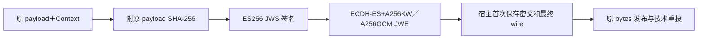
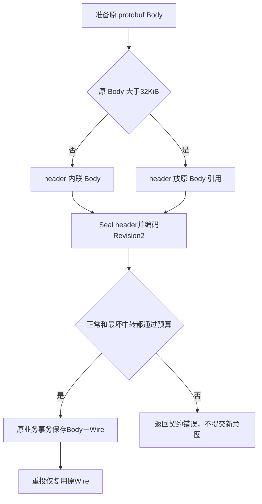

# 安全与大消息

可靠消息必须同时回答三个问题：谁发来的、内容有没有被换过、接收方是否有权执行。Revision2 checksum 或消息指纹只能校验内容关系，不能认证发送者；签名和加密能认证工作负载并保护网络正文，也不能代替业务授权。

当前 SDK 提供固定 `rm-secure-v1` 保护 profile 和 NSQ 尺寸预算。密钥、第一次密文的持久化、原正文服务及业务准入由宿主负责。下面以 QS 与 qs-ai 的模型命令／结果消息说明实际接入；IAM 的普通权限版本提示不会因为引用 SDK 就自动启用这一层。

## 收到一条 checksum 正确的消息，为什么仍不能执行

Revision2 checksum 是 UUID、metadata 和 payload 的公开 SHA-256。能够构造消息的人也能重新计算它。因此 checksum 正确只排除了特定形式的损坏，不能证明 producer 真的是 qs-ai。

protected 将原 payload 与完整 Context 一起签名。Context 包含：

```text
producer       谁发送，例如 qs-ai
destination    谁接收，例如 qs-server
topic          实际约定的消息路径
message_id     原应用身份
metadata       参与认证的网络属性
```

接收方的 expected Context 必须从宿主固定路由、实际收到的 topic 和已约定的协议构造。若直接把未认证报文宣称的 producer、topic 当 expected，字段相等也无法建立正确的信任边界。

例如结果消息从 CommandsTopic 收到，或 signer 属于另一 producer，即使正文和 checksum 都可解析，也必须在进入业务事务前拒绝。验证通过后，宿主还需核对组织、原任务、当前状态、冻结配置和执行授权。

## Seal 究竟保护了什么

[Seal](../../wire/protected/protected.go) 不进行网络或数据库操作，其顺序是：



签名私钥和加密接收方密钥均采用 P-256、带 kid，且不能使用同一实际密钥同时承担两种用途。Seal 对接收方使用可提取的公钥；API 可以接受含私钥的 JWK 对象，但发送方装配应只持有其需要的公钥，不应据此扩大私钥分发。

payload 以原 bytes 保存，hash 校验原内容；签名保护 Context 和 hash；JWE 对签名记录加密。网络加密不意味着数据库静态加密：QS/qs-ai 的原 Body 仍由宿主数据库保存和访问控制。

Go 与 Python 使用相同保护层次。加密具有随机性，两语言生成的密文不必字节相同；互操作要求对方能验证并还原原 payload，而不是要求重新 Seal 出一模一样的字符串。

## Open 的逐层验证顺序

[Open](../../wire/protected/protected.go) 在返回原 bytes 前执行：

1. 检查 expected Context、payload 上限和输入解码预算，要求 Compact JWE 五段。
2. 限制 JWE header 为 alg、enc、kid、typ、cty、epk，固定算法、profile 与 JWS 内容类型。
3. 从宿主 Keyring.Decrypt[kid] 查 P-256 私钥，要求 JWK 自身 KeyID 相同，然后解密。
4. 要求内部为 Compact JWS 三段，header 只允许 alg、kid、typ，固定 ES256/profile。
5. 从 Keyring.Signers[kid] 查 signer，要求其 Producer 等于 expected.Producer，KeyID 相同。
6. 验签后解析记录，比较完整 Context，包括实际 topic、原 ID 和 metadata。
7. 检查原 payload 长度和 SHA-256，返回其独立副本。

JWE 的 epk 是 ECDH 所需的临时公钥，不是可信 signer。不能笼统说“拒绝所有内嵌公钥”；签名信任来自宿主 Keyring，未知 signing jwk、jku 或远程地址不在允许 header 中。

Open 不协商其他算法、不访问远程 key URL、不自动刷新密钥，也不建立重放账本。解密成功仍须验签；验签成功仍须完整路由和业务准入。错误返回固定 ErrProtection／ProtectionError；隔离和审计由宿主完成。

## 为什么密钥轮换不能重新 Seal 原消息

第一次准备消息时，QS/qs-ai 保存原 Body、body_hash、完整 Wire 和 wire_hash。原业务事务提交后，技术重投只读取这份原 wire。

如果每次 retry 重新 Seal，同一原业务意图会得到不同随机密文，不能再复用已保存的原 wire/hash；密钥切换时还会依赖新的密钥可用性。原 Body 不变时，按原身份和 BodySHA 核对的业务回执仍可保持相同；若同时重新构造正文，则可能混入当前配置。技术重投应直接发送第一次保存的 wire，避免重新准备引入这些变化。

轮换应改变新消息使用的 key，同时保留读取旧 wire 所需的可信解密／验签 key，直到待投、待回执、held 和经审核的回退窗口结束。SDK 不加载 KMS、生成生产密钥、安排轮换或销毁历史正文。未知／撤销 key 的历史消息要进入宿主治理，不能悄悄用新 key 重封历史。

## 尺寸预算为什么必须检查终端失败路径

当前 SDK profile 为：

| 项目 | 预算 |
|---|---:|
| 一条 NSQ 网络消息 | 262144 bytes |
| JSON metadata | 4096 bytes |
| 最坏 cause 预留 | 1024 bytes |

[FitsNSQ](../../wire/protected/budget.go) 先编码正常 Revision2 wire，再构造最坏失败中转：将整个原 wire 作为中转 payload，加上 metadata、原物理身份、最大 Attempts/Timestamp 和原因预算。两种消息都必须满足上限。

用实际 Python wire 编码器得到的示例：

```text
原 payload：180000 bytes
正常 Revision2 wire：240223 bytes
最坏失败中转 wire：321628 bytes
SDK profile 上限：262144 bytes
FitsNSQ：false
```

这个例子尚未叠加 JOSE。它已经说明：原正文不到 256 KiB、甚至正常 PUB 可发送，都不能证明失败时仍可转交。JSON/base64 嵌套会再次膨胀；metadata 和错误文本也要留预算。

这里有两项必须由宿主落实的限制：

- Go Publisher 不自动调用 FitsNSQ 或检查 262144。Seal/Open 也不自动调用预算检查；Open 的 `3*maxPayload+8192` 是解码开销约束，不能替代网络上限。
- MaxCauseBytes 是预算假设。Go Subscription 使用 cause.Error()，没有自动截断到 1024 bytes；FitsNSQ 用 ASCII x 预留，而 JSON 对引号、控制符和部分字符还会转义放大。只限定原因原字节数也不一定满足预算，宿主应使用有界、脱敏的固定安全 ASCII 原因，或检查最终编码尺寸。

Python Publisher 校验实际正常 body 上限，仍不能代替最坏中转检查。隔离 NSQ 工作流显式设置了这个 profile 上限；不能据此推断生产 Broker 当前配置相同，更不能通过放大共享 Broker 上限掩盖宿主失控的正文或错误文本。

## QS／qs-ai 怎样发送大正文

当前宿主内联阈值是 32 KiB，原 Body 上限是 MySQL MEDIUMBLOB 容量 16 MiB−1。该策略在宿主 [ProtectMessaging](https://github.com/FangcunMount/qs-server/blob/2ccc2de44bbd45e26d29e7e130da518cc32426f0/internal/apiserver/application/aibridge/messaging_wire.go) 和 [qs-ai prepare](https://github.com/FangcunMount/qs-ai/blob/bd5e18ed4659d1d9d5ab853255577139df173aff/src/qs_ai/infrastructure/workflow_transport/messaging.py) 中实现。



引用包含 producer、destination、原 message_id、body_sha256、body_length 和 organization_id。原 Body 仍保存于发送宿主原 Outbox；小 header/ref 被签名加密后走 NSQ。引用不是由消息提供的任意 URL，也不会指定动态读取端点。

SDK 当前没有通用 BodyReference、对象存储、正文 gRPC 服务、自动分块或自动落库。这是宿主用 protected 和预算原语构成的真实接入案例；将来抽取通用机制也不能顺带把业务 protobuf 和组织准入移入 SDK。

## 接收大结果：先认证引用，再取原 Body

QS 的实际接收顺序为：

```text
实际 topic＋完整原 wire
→ Revision2、checksum、原 ID、固定 metadata 检查
→ 按实际 topic 构造 expected producer/destination
→ Open 验证签名、加密、路由
→ 校验 protobuf schema/kind/原 ID/reference 绑定
→ 通过预配置 mTLS stub 读取原 Body
→ 对响应 reference、原长度、SHA-256、kind／业务身份再核验
→ 宿主原事务幂等接单
→ 才允许消费成功
```

[AuthenticateMessaging](https://github.com/FangcunMount/qs-server/blob/2ccc2de44bbd45e26d29e7e130da518cc32426f0/internal/apiserver/application/aibridge/messaging_wire.go) 做前半段认证。[MessagingPayloadClient.Read](https://github.com/FangcunMount/qs-server/blob/2ccc2de44bbd45e26d29e7e130da518cc32426f0/internal/apiserver/infra/aibridge/messaging_payload.go) 的合同要求 header 已经认证；这个函数本身不做 JOSE，因此不能直接把未认证 protobuf 喂给它。

读取使用宿主预配置的 gRPC 连接、5 秒上限，并冻结请求 reference。返回的 reference 必须完整相同，正文必须满足原长度/hash 和业务类型；即使下载成功，也不能接受内容相近的替代正文。

QS 的正文服务要求已验证 mTLS 证书、调用工作负载为 qs-ai.svc；反向 qs-ai 服务要求 qs-apiserver.svc。服务端再按 producer、destination、message_id、组织和 hash 精确查询原行，复核长度/hash。只知道原 ID 或引用不能获得读取权限。

## 原正文暂不可读时为什么不能改成另一份

引用减少 Broker 压力，却增加原正文服务的可用性和保留责任。mTLS 服务超时、存储不可读或权限拒绝时，应保留原意图并进入宿主技术重试／hold，不能更换正文、改变组织、生成新 ID 或绕过认证。

| 故障 | 接收端应保留什么 | 成功返回之前的前提 |
|---|---|---|
| 签名、路由或 wire 无效 | 原 wire 依据与有界隔离原因 | 宿主持久隔离完成 |
| 正文读取超时／服务不可用 | 原认证 header、原身份和持久失败状态 | 按宿主技术合同处理，不能执行替代正文 |
| 响应引用／长度／hash 不符 | 原引用合同和核验失败 | 拒绝业务执行并持久治理 |
| 失败账本本身不可写 | 尚未结算的原消息 | 返回错误／未知，不先 FIN |
| 接收取消 | 原业务提交可能未知 | 原状态核对，不生成一次新的失败或执行授权 |

原 Body、旧 key 和引用服务不能在短暂队列为空后自动清理。它们的保留至少要覆盖原业务确认和已审核的回退责任；具体时限由宿主治理，不由 SDK 推测。

## 日志不能绕过安全边界

protected 的固定错误分类不代表所有上层错误都已经脱敏。Relay.Err、Go Handler 的任意 error、数据库或 driver exception 仍可能带敏感内容。

适合记录的是有界原因、部署版本、消息定位的受控关联和 hash；不应把密钥、授权 header、完整密文／明文、用户正文或原 ID 放进无界指标标签。未认证报文的 message_id 只是声称，不能作为可信业务身份执行查询或修复。

## 实际测试分别证明了什么

| 验证 | 覆盖范围与前提 |
|---|---|
| [Go protected tests](../../wire/protected/protected_test.go) | 错 producer/topic/id/metadata、篡改、缺 key、复用密钥拒绝；纯编码不证明 NSQ 可发送 |
| [跨语言合同](../../python/tests/test_mq_contracts.py)、[Go probe](../../tests/integration/protectedprobe/main.go) | 双向认证、旧解密 key 保留后的轮换、失败预算；使用测试密钥 |
| [QS mTLS 大正文集成](https://github.com/FangcunMount/qs-server/blob/2ccc2de44bbd45e26d29e7e130da518cc32426f0/internal/apiserver/transport/grpc/aibridge/message_payloads_integration_test.go) | 隔离 MySQL、约128 KiB结果、临时CA、真实TLS gRPC、错工作负载／引用拒绝 |
| [qs-ai MQ 合同](https://github.com/FangcunMount/qs-ai/blob/bd5e18ed4659d1d9d5ab853255577139df173aff/tests/test_mq_contract.py) | 宿主消息族和引用选择，原 wire 不重新 Seal |
| [qs-ai payload probe](https://github.com/FangcunMount/qs-ai/blob/bd5e18ed4659d1d9d5ab853255577139df173aff/tests/probes/mq_payload_acceptance.py) | 一次性NSQ/MySQL/mTLS、认证后取正文、重启后原Body保持；需严格匹配隔离资源 |

源码中有测试不等于本轮已经执行，也不证明生产密钥部署、轮换、正文保留或业务授权已验收。网络保护、可靠结算和业务准入要分别取得证据。
