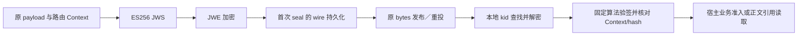
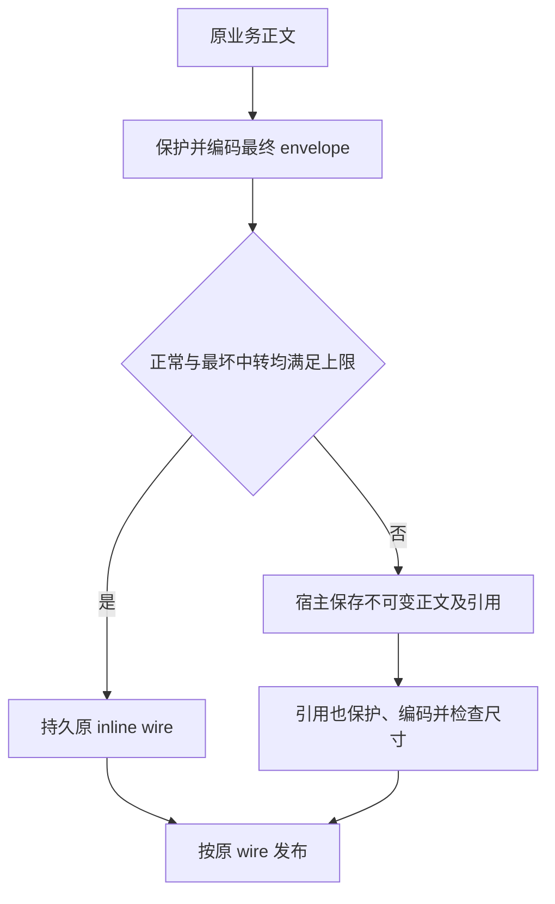

# 安全与大消息

本文回答何时需要保护消息、密钥和原密文由谁管理，以及超过 NSQ 尺寸预算时怎样保留可靠合同。范围为当前 Go/Python protected 与 wire 实现；不是所有宿主事件都默认启用此机制，实际制品和宿主接入状态见[版本索引](../releases/README.md)与宿主文档。

checksum 解决损坏检测，签名和加密解决工作负载认证与内容保护，业务授权解决能否使用这条消息。三者不能替代。SDK 提供固定保护 profile 与尺寸检查；宿主提供可信 key map、权限、原 wire 持久化和认证后正文读取。

## 保护层的设计

`rm-secure-v1` 先用 P-256/ES256 JWS 签名，再用 ECDH-ES+A256KW 和 A256GCM JWE 加密。保护内容包括 payload SHA-256、原 payload 及 Context：producer、destination、实际 topic、message_id、metadata。接收方提供自己的 expected Context 和本地 keyring，认证后核对路由、身份和内容。

Open 拒绝算法协商、未知 header、远程 key URL 和消息嵌入的信任材料；kid 只能在宿主提供的本地 map 中查找。可信 signer 还绑定 expected producer。解密成功不等于验签成功，验签成功也不等于本次业务获准。

expected Context 的来源必须由可信宿主配置与已约定协议决定，不能把未认证报文任意声称的身份直接当作授权依据。SDK 核对字段一致性，不维护 IAM 角色、租户策略或正文访问许可。

## 密钥与原 wire 归属

| 内容 | SDK 合同 | 宿主责任 |
|---|---|---|
| 签名／加密密钥 | P-256、带 kid，签名与加密 key 分离 | 生成、加载、保护、轮换、撤销；与 IAM/TLS 密钥用途分开 |
| 密文 | Seal 纯计算；技术重投不重新 Seal | 第一次 seal 后同事务保存最终 bytes |
| 旧 key | 本地 map 指定可信验证／解密能力 | 待投、待回执与仍有效历史窗口结束前保留适用 key |
| 验证失败 | Go ErrProtection／Python ProtectionError 有界分类 | 持久隔离、审计处置；不自动拉远程 key 或重新加密 |

加密具有随机性。相同 payload 再 Seal 会得到不同 wire，故不能在每次 retry 时重封。key 轮换也不改变原消息身份或密文。未知／撤销 key 的历史消息如何处置，由宿主审计决定；SDK 不以新 key 重写历史来掩盖失配。

签名、加密、body hash 与消息指纹各有作用：保护层验证认证内容和路由，body hash 验证取回正文，message fingerprint 验证原持久意图。没有一个 hash 能独自证明权限或消费效果。

## 尺寸预算要包含失败路径

当前通用检查使用 NSQ `262144` bytes 上限，metadata 上限 `4096` bytes，最坏失败原因预算 `1024` bytes。必须同时检查正常 Revision2 wire 与最坏失败中转 wire，因为失败记录还会携带原消息、metadata 和物理投递信息；原 payload 小于上限不代表最终 wire 一定适合。

Go Publisher 的普通发送路径不代替 `FitsNSQ` 的最坏中转检查。Python Publisher 检查实际正常 body 上限，宿主仍须调用共享预算检查保证失败路径。metadata、错误和安全层膨胀也要计入，不能靠放大共享 Broker 上限规避宿主协议错误。

## 大正文采用宿主不可变引用

超过预算时，宿主在原数据库中保存不可变正文，将定位、原身份、长度、hash 和保留合同放入经过保护的引用消息。SDK 不实现 blob 服务、正文 gRPC API 或业务 protobuf，也不决定正文所属租户。

接收方先验证消息工作负载与路由，再通过明确配置、授权的只读 mTLS 接口取正文；取回后核对原身份、长度与 hash，最后进入宿主事务／幂等处理。不得先使用未经认证的引用查业务数据，也不得允许报文给出任意 URL 或改变读取端点。这个顺序由宿主实现，单独调用 Open 不会自动完成正文准入。

引用减少 Broker wire 尺寸，但增加一个宿主可用性和保留责任。正文暂不可读时保留原待处理意图，按技术合同重试或 hold；不能改成另一份正文、以新 ID 补发或越过授权。未确认／held 行、正文引用与历史解密 key 不能依据短暂队列为空自动清理。

## 不可信输入和日志

| 输入问题 | 可持久保存的依据 | 不应做的动作 |
|---|---|---|
| 未认证／损坏 wire | 原 wire hash、有界原因和审计定位 | 以报文自述 message_id 当可信业务身份 |
| 未知 key／路由失配 | 固定错误类别和原持久记录关联 | 远程找 key、静默换 producer 或重封 |
| 正文长度／hash 不符 | 原引用合同与核验失败 | 接受内容相近的替代正文 |
| 失败中转过大 | 原 wire 与有界隔离记录 | 丢弃原消息或拷贝无限 driver 错误文本 |

Python NSQ 扩展的 invalid_handler 要按原 wire 依据持久隔离后返回；Go 宿主在自己的 handler 准入处实现相应边界。不要把未经核对的原文、解密正文、授权 header、key 或 driver exception 直接作为日志／指标标签。Relay.Err 只是宿主诊断入口，不承诺自动脱敏；宿主在输出前审核。

## 适用限制与取舍

protected 提供固定 profile，不是通用 JOSE 产品，也不自动扩展到所有算法、key 类型或远程信任源。跨语言互操作测试证明指定 codec/profile 的兼容，不代替宿主密钥部署、访问准入、轮换演练或业务恢复。相较只用历史 checksum，保护层增加密钥与正文保留成本；收益是收到消息时可核对真实工作负载及原路由，避免仅凭可重算 checksum 信任业务身份。

## 源码与验证

源码：[Go protected](../../wire/protected/protected.go)、[尺寸预算](../../wire/protected/budget.go)、[Python protected](../../python/src/reliable_messaging/protected.py)、[Python wire](../../python/src/reliable_messaging/wire.py)、[失败中转结构](../../wire/legacy/handoff.go)、[Python 接收准入接缝](../../python/src/reliable_messaging/nsq.py)。

验证：[Go 安全合同](../../wire/protected/protected_test.go)、[跨语言 JOSE／路由／轮换／尺寸](../../python/tests/test_mq_contracts.py)、[跨语言 probe](../../tests/integration/protectedprobe/main.go)、[Python NSQ 失败路径](../../python/tests/test_nsq_integration.py)。具体宿主正文读取与密钥上线证明留在宿主文档，不能由这些 SDK 用例替代。
