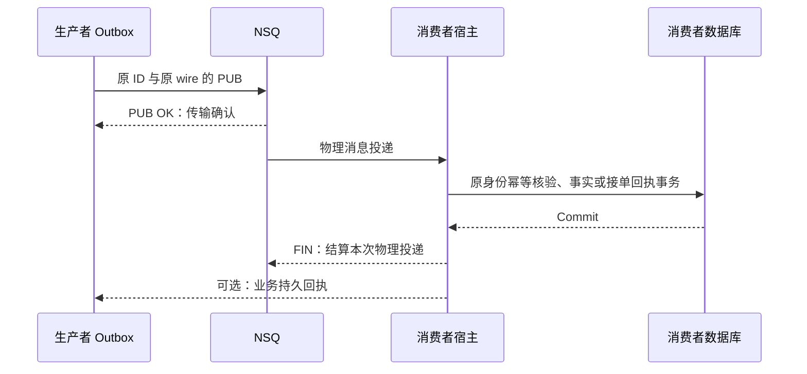
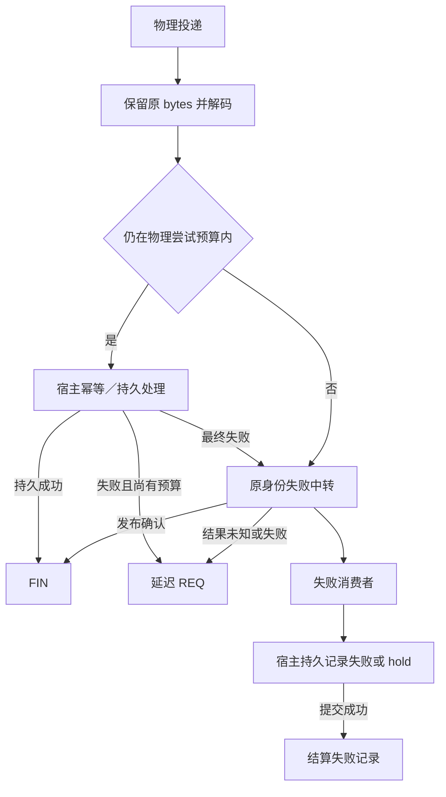

# 投递与消费

本文回答发送何时算成功、消费者何时 FIN，以及幂等和失败中转由谁保证。范围为当前 NSQ 适配与持久结算实现；支持版本、驱动和拓扑见[兼容与升级](../03-维护与验证/兼容与升级.md)。

Broker 发布确认、NSQ FIN 和业务持久回执是三个不同边界。SDK 统一运输与结算机制；宿主必须把业务事实或持久接单提交放在成功回调／FIN 之前，并按原应用身份处理重复。任何一层的 `Confirmed` 都只能证明该接口定义的确认对象。

## 正常链路与确认层次

FIN 前的业务提交由宿主 callback 合同保证，SDK 不读宿主事务判断它是否真的提交。业务持久接单也不必等于模型执行或报告全部完成：具体回执确认“接单”还是“完成”，由业务流定义。生产者需要该回执时，按回执型 Outbox 结算；否则标准 Store 的 published 不证明下游完成。

| 证据 | 证明什么 | 不证明什么 |
|---|---|---|
| `transport.Confirmed`／Python `Confirmation.BROKER` | 本次 PUB 获得 Broker 接受响应 | 同步 fsync、消费接单、业务完成 |
| NSQ FIN | 消费者结算了这次物理投递 | SDK 自动验证了业务数据库提交或所有消费者效果 |
| Python `DURABLE_ACCEPTANCE`／回执表 confirmed | 宿主 callback 或认证回执核验了原业务 ID 的持久接受 | 自动获得业务重试许可或模型执行完成 |

## 发布结果与重复

Go Publisher 只返回 `Confirmed/Unknown/Rejected`。本地无效路由、topic 或空 bytes 为 Rejected；driver 错误、超时和失联保守记为 Unknown，因为 Broker 可能已经接受。NSQ 适配不内部重试，由宿主注入的 RetryPolicy 或原扫描循环决定原消息何时重投或隔离。

go-nsq Publish 无 context 参数。超时调用对调用者返回 Unknown，但实际 driver 调用仍占用有界 in-flight slot，直到它真正结束。这样不会因重复超时无限生成发送任务；也意味着 Relay 返回和资源真正关闭是两种证据。详见[生命周期与恢复](生命周期与恢复.md)。

Unknown 重投、PUB OK 后数据库结算失败、消费者 Commit 后 FIN 丢失，都可能产生重复。去重必须位于宿主权威事实／回执边界。SDK 保留 ID 和 bytes，为幂等提供前提；它没有通用业务 Inbox，也不能从“handler 被调用一次”推断副作用只发生一次。

## Go Subscriber 的结算合同

`transport.Delivery` 分开应用 ID 与物理 TransportID，Message 返回副本。显式 Ack/Nack 优先于 handler 返回值且只结算一次；未显式结算时，nil 返回 Ack，错误返回 Nack。宿主不能先 Ack 后尝试业务提交，也不能把取消后的未知业务结果以 nil 返回。

禁用 driver 自带尝试截止，防止 go-nsq 绕过 SDK 直接丢弃消息。达到终结条件后，原消息只在失败中转 PUB 获得确认后 FIN；确认丢失会 REQ 原消息并可能形成重复失败记录。宿主 FailedHandler 必须幂等持久保存失败／hold，成功返回才结算中转消息。

SDK 的 MaxAttempts 是物理投递预算。重新 PUB 会得到新的物理尝试序列，不能因此重置逻辑业务失败预算。需要跨重投限制的流，由宿主原事务持久保存预算和治理决定；失败中转不授予再次执行模型或通知的权限。

## NSQ topic、channel 和来源节点

持久 channel 必须在第一条业务 PUB 前准备。Provisioner 使用显式 nsqd HTTP URL，先建 topic 再建 channel；部分失败不算 ready，也不从 TCP 地址猜 HTTP 端口。新增发布节点后重新核验准备范围。

Go Subscriber 支持显式 nsqd 或 lookupd，两者择一。它先连接失败消费者，再连接业务消费者；发现新源节点时，失败中转必须先确认该源节点的失败消费者 ready，才能发送终结记录。低层 Subscription 不持有连接，宿主必须自己满足相同顺序。

Python 可选 NSQ 扩展使用显式 nsqd 地址和同一 asyncio loop，不实现 Go lookupd 动态发现。它要求 `failure_ready` 验证具体来源节点，failed/invalid callback 持久保存后才 FIN；取消保留未结算状态。Go handler 的显式 Ack/Nack 和 Python callback 返回合同不同，不应互相照搬调用示例。

## 丢失与最佳努力边界

NSQ PUB OK 不保证强杀后的内存消息存活。既有隔离表征在持久卷保留的情况下观察到已确认内存队列丢失；正常重启保持消息不能推出 SIGKILL 等价。标准 Relay 仅扫描待投／过期领取，不会自动发现 published 之后的 Broker 丢失。需要恢复效果的流必须依靠宿主业务对账或持久回执，不能把所有 published 行重置后重发。

`catalog` 的 best_effort 与 durable_outbox 是宿主明确选择的可靠性分类。直接 PublishRaw、外围通知和 Redis signaling 不因经过 SDK 就获得本地事务保障。Redis Publish 成功也不代表接收者读取或持久效果；丢提示由宿主持久查询／轮询补足。

## 失败窗口与设计代价

| 窗口 | SDK 行为 | 宿主必须提供 |
|---|---|---|
| PUB 响应丢失 | Unknown，保留原 bytes 重投前提 | 幂等、持久预算和效果核验 |
| 消费持久提交失败 | handler 返回错误，REQ 或失败中转 | 不返回成功、不先 FIN |
| 已提交但 FIN／回执丢失 | 重复物理投递或待回执重投 | 原身份重复接单只产生一次效果 |
| 失败中转确认丢失 | 原消息 REQ，可能重复失败记录 | 幂等失败账本和持久 hold |
| Broker 确认后丢失消息 | 不能由 published 自动证明恢复 | 逐流权威事实／回执和安全恢复授权 |

分层确认需要宿主保留更多账本和对账入口，但避免把接单、运输和完成混为一谈。业务要求若只需最佳努力，可以明确选择较轻合同；要求必达或未知外部副作用保护时，不能仅用 PUB OK 代替持久回执。

## 源码与验证

源码：[发布结果](../../transport/publisher.go)、[Delivery](../../transport/subscriber.go)、[NSQ Publisher](../../transport/nsq/publisher.go)、[Subscription](../../transport/nsq/subscription.go)、[Subscriber](../../transport/nsq/subscriber.go)、[Provisioner](../../transport/nsq/provisioner.go)、[Python NSQ](../../python/src/reliable_messaging/nsq.py)、[持久回执结算](../../python/src/reliable_messaging/delivery.py)。

验证：[丢 PUB 确认](../../tests/integration/nsq_test.go)、[终结中转与订阅](../../tests/integration/nsq_subscription_test.go)、[实库失败记录](../../tests/integration/nsq_failure_audit_test.go)、[首次 PUB 前准备 channel](../../tests/integration/nsq_provisioner_test.go)、[Broker 重启表征入口](../../tests/integration/brokerrestart/main.go)、[Python NSQ 集成](../../python/tests/test_nsq_integration.py)。已有故障结果保存在[历史 M2 证据](../_archive/milestones/m2-evidence.md)，只代表其中规定的隔离配置，不代签宿主生产恢复。
