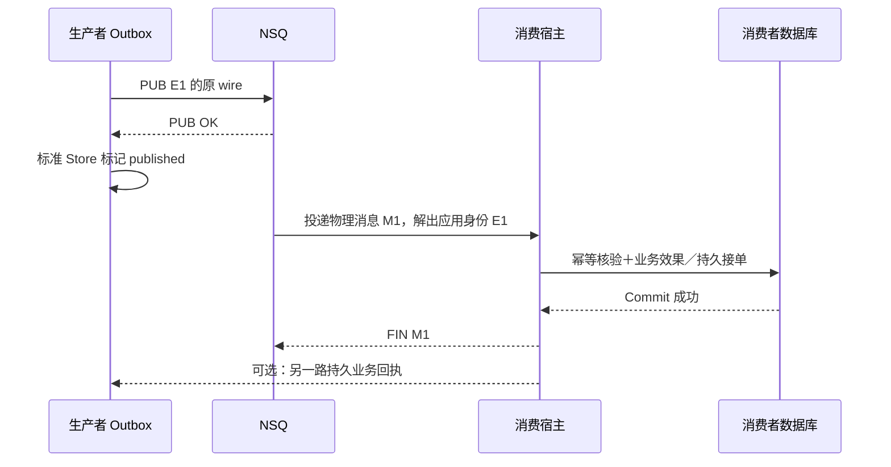
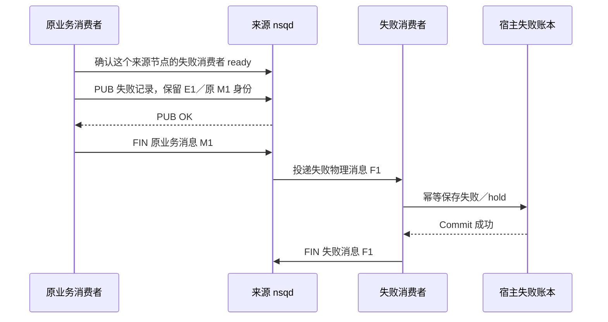

# 投递与消费

一条消息“发送成功”，必须指明成功到了哪里。NSQ 的 PUB OK 表示 Broker 接受了这次发布；FIN 表示某个 channel 上的一次物理投递被结算；业务回执表示接收服务已按约定持久接受原消息。这三个边界不能互相代替。

本文用原应用消息 `E1` 和 NSQ 物理消息 `M1/M2` 串起发送、消费和失败转交。应用身份与网络编码见[消息身份与协议](消息身份与协议.md)，本地事务与领取结算见[事务与 Outbox](事务与Outbox.md)。

## 一条消息怎样经过三个确认边界

假设 QS 已在业务事务中保存 `E1` 及其原 wire，Relay 随后领取它：



消费宿主何时算“持久接受”，取决于业务。例如 Worker 调用 QS API 建立测评，成功边界应包含权威业务事实；qs-ai 接收模型命令，成功边界可以是任务、冻结配置和接单回执已经持久保存，模型执行随后进行。不能为了让 FIN 看起来快，把尚未持久接单的工作只放进内存队列。

| 确认证据 | 具体证明对象 | 仍然没有证明的事情 |
|---|---|---|
| Go `transport.Confirmed`；Python `Confirmation.BROKER` | 这次 PUB 收到 Broker 接受响应 | 同步落盘、消费者提交、报告生成 |
| NSQ FIN | 这个 channel 上的物理消息已结束本次投递 | SDK 检查了业务提交、其他 channel 也完成 |
| 经验证的业务回执；Python `DURABLE_ACCEPTANCE` | 原应用 ID 已达到宿主声明的持久接受边界 | 模型调用一定完成、任何重复调用都得到授权 |
| 标准 Outbox 的 `published` | 原行当前领取获得 PUB 确认并成功结算 | 下游结果已完成或 Broker 强杀后消息仍在 |

SDK 不窥探消费宿主的事务。回调“先提交、再成功”的约定需要宿主代码和测试落实；返回 nil 或调用 Ack 本身不能证明数据库已经提交。

## PUB 结果未知为什么必须允许重复

Go Publisher 返回三种结果：

- `Confirmed`：本次 Broker 发布获得确认。
- `Rejected`：适配器在本地确认不能发送，例如无效 topic、没有匹配路由或空 bytes。
- `Unknown`：超时、连接异常或 driver 错误，无法排除 Broker 已接受。

NSQ 适配器不偷偷重试。Relay 将非确认结果交给宿主提供的 RetryPolicy；策略选择延迟重投或隔离，重投继续使用原 ID 和原 bytes。Unknown 不等于“从未发送”，也不等于“允许重新执行外部副作用”。

考虑下面两个窗口：

```text
窗口 A：PUB E1 → NSQ 创建 M1 → PUB OK 丢失
        → Publisher 返回 Unknown
        → 原 E1 再 PUB → NSQ 创建 M2

窗口 B：PUB E1 → PUB OK → Store.Confirm 未成功持久结算
        → 原行仍为可恢复的领取
        → 租约过期后再 PUB → 创建 M2
```

Confirm 返回错误本身不能判断数据库是否已经更新：若原行实际已为 published，标准扫描不会再次领取它。窗口 B 指的是核对后原行仍为 publishing 的情况。

M1 与 M2 的物理身份、物理尝试数不同，但都应解出同一个 E1。消费者若仅按 NSQ TransportID 去重，会把 M2 当成新业务。SDK 保留原应用身份，为幂等提供前提；实际去重必须落在业务权威事实或持久接单回执上。

go-nsq 的 Publish 没有 context 参数。SDK 超时返回 Unknown 后，真实调用可能还在运行，其 in-flight slot 直到真实调用结束才释放。这限制了无限超时堆积，同时要求停机时区分“调用者已返回”与“真实发送已排空”，详见[生命周期与恢复](生命周期与恢复.md)。

## 消费幂等应写在什么地方

以 QS 的测评流为例：一份已绑定模型的答卷提交产生原事件，Worker 接收后调用 API。API 按 AnswerSheetID 查已有测评、校验开展上下文和测评状态、处理重复创建，并对已有 pending 测评补提交。原事件身份用于消息追踪；当前 EnsureAssessment 请求没有传递原事件 ID，这条链路的持久幂等依靠业务关联，不能写成按 E1 保存通用 Inbox。Worker 的 Redis 抑制只减少并发重复请求，不能替代 API 的持久判断。

业务已经提交、FIN 丢失时，NSQ 会重新投递。正确的重复路径是：

1. 从消息中取回原应用身份和业务关联。
2. 查到原处理事实或原结果，校验当前消息没有改变原意图。
3. 返回已存在的结果，结束这次物理投递。
4. 若原事实尚未提交，继续按业务事务处理，而不是仅凭一条“正在处理”缓存跳过。

某些消费不需要创建通用 Inbox。IAM 的权限版本通知是提示 QS 回查 IAM 权威版本、使旧权限缓存失效，幂等合同是重复提示不会恢复旧权限、丢提示仍有回查上限。它与“创建测评只能一次”的合同不同。

QS 的具体关联和状态转换仍归宿主负责。参考固定代码：[Worker 消费入口](https://github.com/FangcunMount/qs-server/blob/2ccc2de44bbd45e26d29e7e130da518cc32426f0/internal/worker/handlers/answersheet_handler.go)。这些业务约束不能由 SDK 的一次 Ack 自动推导出来。

## Go Handler 何时 Ack，何时 Nack

`transport.Delivery.Message()` 返回副本，包含应用 ID、物理 TransportID、topic/channel、正文和 Attempts。Go 的结算规则在 [HandleBusiness](../../transport/nsq/subscription.go) 中：

| Handler 行为 | SDK 的结算结果 |
|---|---|
| 未显式结算，返回 nil | Ack，执行 FIN |
| 未显式结算，返回错误 | Nack，进入重试或失败转交 |
| 已显式 Ack，再返回错误 | 不撤销第一次 Ack；FIN 已发生 |
| 已显式 Nack，再返回 nil | 不改成 Ack；保持第一次结算 |
| 多次 Ack/Nack | 只有第一次产生结算 |

因此持久业务处理通常采用“提交成功后返回 nil”。不要先 Ack 再提交，也不要捕获取消后返回 nil：取消时业务提交或外部调用可能处于未知状态，必须保留原持久状态和后续核对入口。

低层 Subscription 会关闭 driver 自动回复；`ConsumerConfig` 同时将 driver 的 MaxAttempts 设为 0，避免 go-nsq 在宿主尚未保存失败记录时自行 FIN 毒消息。自己装配低层 driver 的宿主必须保留这两个约束。

## 重试计数不是同一个预算

重投并不一定增加同一个计数。排查“为什么还在重试”时必须先确定观察哪一层：

| 计数 | 何时变化 | 能否限制原业务总次数 |
|---|---|---|
| `Received.Attempts` | 同一 NSQ 物理消息的再次投递 | 不能；重新 PUB 得到新的物理序列 |
| 标准 Store `Claim.Attempts` | 一次新的领取 | 不能等同真实 PUB 次数；领取后可在发送前退出 |
| 标准 Store `FailureCount` | 当前领取成功写入 Retry／Quarantine | 租约过期本身不增加它 |
| 回执 Outbox 的 attempts | 按该行的发布／回执规则结算 | 与标准 Store 不同；最终 ACK 的成功重投不消耗失败预算 |
| 宿主逻辑业务预算 | 宿主在原事务持久结算失败或治理决定 | 可跨物理重投约束原任务，但不能由 SDK 替宿主决定 |

Subscription 的 MaxAttempts 约束物理投递。若原消息以新的物理 ID 重新发布，它仍需由宿主保留原逻辑失败预算。未知模型调用、通知结果未知等状态不能仅因物理次数归零就重新执行。

## 失败中转实际上有两次 FIN

假设 MaxAttempts=2，M1 第一次处理失败后 REQ，第二次仍失败。Subscription 不直接丢弃 M1，而是把原身份、来源、正文、尝试数和 cause 编成失败中转记录：



**原 M1 的 FIN 等的是失败记录 PUB 确认；失败 F1 的 FIN 才等宿主失败账本提交。** 两者之间仍有 Broker 持久性窗口。如果失败记录在内存队列中被确认后丢失，SDK 不能声称宿主一定保存了审计。

中转发布结果未知时，原 M1 继续 REQ。下次可能再发布失败 F2，因此 FailedHandler 必须以原来源 topic/channel、原应用身份和原物理身份等宿主确定的键幂等保存，不能只去重 F1/F2 的新物理 ID。超过业务尝试上限后继续投递 M1，会直接尝试中转，不再授予业务 Handler 新的执行机会。

失败审计数据库暂时不可用时，失败消费者 REQ F1；成功持久保存后才 FIN。失败审计没有沿用原业务 MaxAttempts 自动丢弃。Go 的待中转 cause 缓存仅在内存中，进程重启后可能退为“此前处理失败”的通用原因；已经编码的中转记录保留其原 cause。

Go 原业务 Handler 返回的错误或 Nack(cause) 可能进入中转正文，宿主要避免密码、令牌、个人信息等未经筛选的错误文本。FailedHandler 返回的错误会让失败消息 REQ，不会被重新编码为这份原业务 cause。Python 的对应中转使用固定 `handler_failed`，语言实现不能机械互换。

## 为什么必须在来源 nsqd 上准备失败消费者

NSQ 节点各自接受和保存消息。消费者从 nsqd-A 收到 M1，却只在 nsqd-B 建了失败 channel，然后在 A 发布失败记录，并不能证明 A 的失败记录有人可靠接收。

[DirectHandoff.Ready](../../transport/nsq/handoff_transport.go) 先把失败消费者连接到 M1 的真实来源地址，再建立该地址的中转 Publisher。只有 Ready 成功且在同一来源节点 PUB 获得确认，原消息才能 FIN。

完整 Go Subscriber：

- 构造时只校验配置，Subscribe 才开始连接。
- 显式 nsqd 与 lookupd 二选一。
- 先准备失败消费者，再接纳业务投递。
- lookupd 发现后续加入的来源节点时，中转仍逐个核对真实来源。

lookupd 是发现入口，不是复制或持久化层。lookupd 中断时已连接 nsqd 的消费可以继续；新节点发现可能停滞，不能用“已连接节点仍能消费”证明所有来源均覆盖。

## 持久 channel 与临时 channel 应分别使用

`Provisioner.EnsureChannel` 用宿主给出的 nsqd HTTP URL 先创建 topic、再创建持久 channel。必须覆盖每个可能接收首条 PUB 的节点，并在业务开放前成功完成。它不会从 TCP 端口猜 HTTP 端口；节点增加后需要重新核验准备范围。

多个实例使用同一个持久 channel，通常用于竞争消费同一份工作；不同 channel 用于分别接收各自的消息副本。临时 `#ephemeral` channel 是在线实例提示，不能作为进程退出后的恢复账本。

Go 的稳定 FailedHandoffGroup 可让替换后的实例继续接收旧实例已经转交的失败记录；它不能恢复从未进入失败中转、随临时 channel 消失的消息。权限提示采用临时订阅时，权威版本回查和缓存陈旧上限仍是 IAM/QS 的责任。

## Python 的消费合同与 Go 有哪些差别

Python NSQ 扩展在同一 asyncio loop 上使用显式 nsqd 和来源地址到 Publisher 的映射，不提供 Go 的 lookupd 动态发现，也不接受临时 channel。

它的业务 callback 正常返回后 FIN；异常按物理预算 REQ 或中转；取消保持未知结果，不 FIN。无法解码、缺少应用身份或非法 metadata 时，先调用宿主 invalid_handler 持久隔离原 wire，成功后 FIN；隔离失败继续 REQ。这与 Go 对未识别旧 wire 可走原始正文路径的策略不同。

中转超出尺寸预算时，Python 也先要求 invalid_handler 保存原记录再 FIN。它没有因为“错误难处理”就直接跳过消息。具体接口见 [NSQSubscriber](../../python/src/reliable_messaging/nsq.py)。

`deliver_durable` 又是另一种合同：宿主 callback 必须返回针对原 ID 的持久接受凭据，普通 Broker 发布结果不能冒充接受回执。不要把标准 PUB、Python callback 的完成和接单回执写成同一种 Confirmed。

## Broker 确认后的丢失由谁恢复

当前隔离测试刻意保留持久卷、强杀 nsqd，观察内存队列消息是否存活。[integration.sh](../../scripts/integration.sh) 中的强杀表征验证了丢失窗口；这不是声称恢复成功的测试。

标准 Relay 不重新扫描全部 published 行。否则已经正常完成的通知和具有外部副作用的命令都会被盲目再发。要求端到端恢复的流必须额外选择：

- 原持久业务回执：没有收到原消息的业务接受，按该行治理合同继续等待或恢复。
- 权威效果对账：从业务事实找出真实缺口，生成有审计的恢复计划，再用宿主允许的原意图恢复。
- 最佳努力：允许丢提示，但提供失败可见性或持久查询补偿，不把它宣称为必达。

`catalog` 的 reliable 分类记录的是宿主选择的合同，不能使直接 PublishRaw 或 Redis signaling 自动获得业务事务保障。Redis 的发送成功不证明任何读者收到；持久扫描才是恢复依据。

## 可以用哪些测试反证错误接入

| 需要验证的窗口 | 当前隔离验证 | 不能据此推导的结论 |
|---|---|---|
| PUB OK 丢失，原 wire 再发 | [NSQ 发布测试](../../tests/integration/nsq_test.go) | 任意业务副作用均已幂等 |
| 失败中转确认丢失、连接断开 | [订阅集成测试](../../tests/integration/nsq_subscription_test.go) | 原消息 FIN 前已有失败账本 |
| 失败审计数据库不可用／进程退出 | [实库失败审计](../../tests/integration/nsq_failure_audit_test.go)、[进程重启](../../tests/integration/nsq_failure_audit_process_test.go) | Broker 的 PUB OK 等于同步落盘 |
| 新节点加入、替换临时实例 | [动态节点](../../tests/integration/nsq_dynamic_node_test.go)、[订阅测试](../../tests/integration/nsq_subscription_test.go) | 临时业务消息能够离线恢复 |
| 首次 PUB 前持久 channel 已准备 | [Provisioner 集成](../../tests/integration/nsq_provisioner_test.go) | 未列出的节点也已经准备 |
| Python 持久处理屏障和取消不 FIN | [Python NSQ 集成](../../python/tests/test_nsq_integration.py) | Go/Python 的所有调用和拓扑均对称 |

这些验证分别覆盖运输和 callback 合同。宿主上线仍需证明其真实业务事务、原身份去重、冻结任务恢复以及效果缺口治理；通过一次 SDK 消费测试不能代替这些事实。
