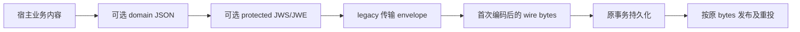

# 消息身份与协议

本文回答如何识别同一持久意图、为何重投必须保持原字节，以及领域 JSON、传输 envelope 和保护层的关系。范围为当前 Go/Python 实现；各协议的制品支持版本见[版本索引](../releases/README.md)。

消息的应用身份由 `producer + message_id + destination` 组成，技术重投必须复用这组三元组和第一次持久化的内容。NSQ 物理 ID、投递次数、领取 token 和租约只描述一次运输或领取，不能生成新的业务意图。

## 身份解决的是什么问题

Broker 可能已接受消息，但生产者未收到确认；消费者也可能已提交效果，但 FIN 或业务回执丢失。重新发送同一业务意图会产生新的物理投递。只有稳定的应用身份，才能让宿主识别重复并关联原事实、原回执和原审批。

`destination` 是稳定的逻辑路由，不是消费者实例或临时 channel 名。多个消费者的独立幂等关系由宿主定义，不能仅凭生产者三元组推导。换 Broker、扩实例或改发现方式不应重建原消息 ID。

| 标识 | 所属层 | 是否改变持久意图 |
|---|---|---|
| producer/message_id/destination | 应用发布意图 | 是身份的一部分 |
| event_type/schema_version/scope | 内容和业务合同声明 | 字节变化会改变指纹 |
| NSQ TransportID/Attempts | 一次物理投递 | 否 |
| RecordID/token/version/lease | 一次存储领取 | 否；RecordID 对 Relay 不透明 |
| 消费者幂等键、业务请求 ID | 宿主业务事实 | 宿主规定，不由 SDK 自动生成 |

## 不可变内容指纹

Go `message.New` 验证必填 UTF-8 字段的字节上限、RFC3339 时间字符串和非空 payload，并持有 payload 副本；读取时也返回副本。Python 对应实现使用相同身份规则和指纹算法。

指纹输入为 `rm-fingerprint-draft-v1` 加一个零字节，再按以下顺序拼接九项：producer、message_id、destination、event_type、schema_version、scope、content_type、occurred_at、payload。每项之前写入八字节无符号大端长度，整体计算 SHA-256。前缀虽然保留 `draft`，仍是当前持久合同的一部分，不能在发布稳定版时擅自改名或重算历史数据。

不做 JSON canonicalization、空白整理、字段排序或时区重写。语义相等的 JSON 也可能具有不同指纹。同身份同指纹的重复追加可按适配器合同幂等；同身份不同指纹返回冲突，宿主必须停止该事务，而不是覆盖原内容。

这是内容一致性检查，不是业务 schema 验证或发送者认证。SDK 不验证 IAM PolicyVersion、QS 组织范围、模型配置或 Task 权限。`message_id` 与业务 envelope 中 ID 是否一致，也须由宿主接缝核对。

## wire 分层

这是一条可用组合，不要求所有流都采用每一层。IAM 原 JSON、历史领域 envelope 和 AI 保护消息可以有不同的宿主编码。NSQ `Publisher.Publish` 发送 `Message.Payload`，`PublishRaw` 发送已编码 bytes；两者都不会自动为业务内容补 envelope 或执行加密。

| 层 | 提供的语义 | 未提供的语义 |
|---|---|---|
| `wire/domain` | 通用事件 JSON 的结构与历史元数据时间格式 | 具体业务类型、payload 有效性、授权 |
| `wire/legacy` | 应用 UUID、metadata、opaque payload；Revision1/2 编解码 | 业务语义及发送者认证 |
| `wire/protected` | 固定安全 profile，绑定工作负载路由与内容 | 宿主权限、密钥轮换决策、正文服务 |

`wire/domain.EncodeEvent` 用于首次编码宿主事件；不是把持久消息解码重建后再投递的许可。技术重投应取原 bytes，避免丢未知字段或改变时间和 JSON 表示。

## 历史 envelope 与损坏消息

legacy envelope 保留 `component-base.messaging.message.v1` discriminator。Revision1 无 revision/checksum 字段；Revision2 包含 revision 和对 UUID、排序 metadata、payload 的 checksum。识别为 envelope 后，未知 revision 或损坏 checksum 返回错误，不能按成功业务消息确认。

未识别为 legacy 的原 body 与“识别成功但损坏”不同。Go NSQ 适配对原 body 保留 bytes，并可能以物理 ID 作为运输标识；宿主必须决定其业务准入。不能把这个 fallback ID 当作认证过的生产者身份。需要 protected 消息的流先认证再使用业务 ID 或正文引用，见[安全与大消息](安全与大消息.md)。

checksum 可发现内容损坏，但没有秘密材料参与，攻击者也可重算。它不替代签名、mTLS 或业务授权。

## 失败与取舍

| 失败窗口 | 保留什么 | 宿主如何处理 |
|---|---|---|
| PUB 结果未知后重投 | 原身份、原 wire、原 fingerprint | 接受重复物理投递，按业务幂等／回执核验 |
| 同身份出现不同 bytes | 第一次持久内容 | 回滚冲突写入并调查，不改原行 |
| 收到损坏／未知协议 | 原始 body 和有界分类 | 持久隔离或失败治理，避免解析后凭空构造可信身份 |
| 密钥轮换时历史消息待投 | 原密文及旧 key 标识 | 保留适用旧验证／解密能力；不自动重封历史消息 |

保持原 bytes 会保留早期编码和密文，迁移成本由此显式存在；收益是重试、回执和审计都能指向同一原意图。需要改变业务内容时，应建立新的业务动作及身份，而不是假借技术重投修改原消息。

## 验证与版本限制

共享[身份向量](../../contracts/fixtures/identity-vectors.json)证明两语言算法与样例关系一致，不证明消息业务有效、历史表已迁移或生产双方已经采用该协议。wire 兼容、protected 互操作与宿主字段校验各需自己的证明。

源码：[Go message](../../message/message.go)、[Python message](../../python/src/reliable_messaging/message.py)、[domain](../../wire/domain/envelope.go)、[legacy](../../wire/legacy/envelope.go)。验证：[身份兼容](../../tests/compatibility/identity_test.go)、[历史 envelope](../../tests/compatibility/historical_envelope_test.go)、[Go wire 测试](../../wire/legacy/envelope_test.go)、[Python 跨语言合同](../../python/tests/test_mq_contracts.py)。
