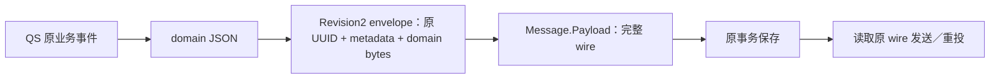

# 消息身份与协议

本篇用一条合成 IAM 版本通知和 QS 答卷事件解释：业务正文如何成为持久意图、网络信封如何携带原身份，以及接收方究竟得到哪些字段。**同一条消息要靠稳定的应用身份和首次字节识别；NSQ 物理 ID、JSON 语义相等或一个可重算 checksum 都不能代替这两件事。**

当前 Go/Python 共享部分指纹和 wire 合同，但接收策略并不完全相同。制品支持范围见[版本索引](../releases/README.md)，本文实现核对基线为 SDK `a62e905`。示例 ID 和正文均为合成数据。

## 身份解决的是什么问题

一次消息 `E1` 被 NSQ 接受，但 PUB OK 丢失，Outbox 又投了一遍，会产生两条物理消息 `M1/M2`。消费者若按 M1/M2 去重，就会把它们当成两个新事件；若按原 E1 关联业务事实，才能识别“同一意图再次到达”。

因此需要分开这些身份：

| 标识 | 定位什么 | 用途与限制 |
|---|---|---|
| `producer + message_id + destination` | 生产者的一项持久发布意图 | 标准 Outbox 唯一身份；同一事件可以向不同目的地分别发布 |
| 原业务事件／任务 ID | 宿主权威业务事实 | 宿主用来查接单、结果或回执；SDK不定义具体业务去重规则 |
| NSQ TransportID、Attempts | 当前物理消息及其投递 | 同意图再次 PUB 会生成新的物理 ID，不能代替应用身份 |
| RecordID、claim token/version/lease | 一次存储领取与结算资格 | 只服务于调度；不创建新的业务意图 |

destination 是稳定逻辑路由，不应使用某个消费者实例或临时 channel 名。换 Broker 或更换进程实例，不应该因此生成新的原消息身份。消费者自己的去重键仍按该消费效果定义，不从生产者三元组自动推导。

## 从权限正文到 Message

假设原业务事件表示“授权策略版本变为 42”，事件 ID 是 `iam-example-42`，发生时间固定为 `2026-10-06T10:00:00+08:00`。业务正文为：

```json
{"version":42}
```

宿主把这组事实映射为 SDK Message。下面是使用公开 API 的片段，省略 import 和错误处理；完整追加方式见[Go 接入](../02-接入指南/Go接入.md)。

```go
intent, err := message.New(message.Input{
    Producer:      "iam",
    ID:            "iam-example-42",
    Destination:   "iam.authz.version.v2",
    EventType:     "iam.authz.version_changed.v2",
    SchemaVersion: "v2",
    Scope:         "scope:global",
    ContentType:   "application/json",
    OccurredAt:    "2026-10-06T10:00:00+08:00",
    Payload:       []byte(`{"version":42}`),
})
```

[message.New](../../message/message.go)会检查必填字符串的 UTF-8 与字节上限、RFC3339 时间和非空 payload，复制 payload，计算指纹。读取 Input 也返回 payload 副本，Publisher 对返回值的修改不能悄悄改变下一次持久投递的内容。

它不会读取 version 判断是否为有效授权版本，不会核验 scope:global，也不会检查正文的业务 ID 与 Input.ID 一致。这些是宿主事件适配和消费准入的工作。Message 也不是网络信封：它的各字段不会因调用 NSQ Publish 自动出现在网络消息里。

### 同身份重复追加意味着什么

标准 MySQL/Mongo Appender 定位原身份，再核对指纹：

- 同身份、相同指纹：复用既存意图，不建立第二项，也不把已结束的发送重新打开。
- 同身份、不同指纹：冲突，不覆盖原意图；宿主需回滚这次写入。
- 新 message_id：另一项意图，不能靠这种方式“重试同一事件”。

这只保证追加一致性，不证明业务已经处理过。消费者仍需用自己的权威记录判断重复。具体事务与表操作见[事务与 Outbox](事务与Outbox.md)。

## 不可变内容指纹

### 为什么散列原字节，而不比较业务含义

上述合成 Message 的 SHA-256 指纹是：

```text
b700b1ebc3ce80b897bfb8482f1d09e0ea80d8d5c18eccc2966132456235f16c
```

把正文改为 `{ "version": 42 }`，语义相同，但字节不同，指纹变成另一值。把 occurred_at 改成表示同一时刻的 `2026-10-06T02:00:00Z`，也会改变指纹。

SDK 不做 JSON canonicalization、空白整理、字段排序或发生时间重写。若宿主需要规范化，应在首次构造和持久化之前完成；重投读取原记录。否则未知扩展、历史格式或密文都可能被“重新构造”改变。

### 长度前缀解决什么歧义

算法先写固定域前缀，再按固定顺序写九项，每项前加八字节大端的 UTF-8／payload **字节长度**：

```text
SHA256(
  "rm-fingerprint-draft-v1\0"
  || len64(producer)       || producer
  || len64(message_id)     || message_id
  || len64(destination)    || destination
  || len64(event_type)     || event_type
  || len64(schema_version) || schema_version
  || len64(scope)          || scope
  || len64(content_type)   || content_type
  || len64(occurred_at)    || occurred_at
  || len64(payload)        || payload
)
```

如果只拼字符串，`["ab","c"]` 与 `["a","bc"]` 都变成 abc；长度前缀使各字段边界明确。字符数与 UTF-8 字节数不同，跨语言不能用字符串字符长度代替字节长度。

前缀中保留 draft 是现有持久合同的实际内容，不是重命名为稳定版时可随意删掉的注释。改变它会使所有历史指纹变化，必须按协议变更处理。

指纹没有秘密材料，只用于核对“是不是原内容”；它不认证发送者，不证明消息有业务权限。

## wire 分层

### IAM：原正文在发布边界包成信封

IAM 采用原版本正文入 Outbox，在确定的发布适配中生成 Revision1 信封。上述合成例子的网络 JSON 为：

```json
{"type":"component-base.messaging.message.v1","uuid":"iam-example-42","metadata":{"aggregate_id":"42","aggregate_type":"PolicyVersion","event_type":"iam.authz.version_changed.v2","source":"iam-outbox-relay"},"payload":"eyJ2ZXJzaW9uIjo0Mn0="}
```

payload 是原 `{"version":42}` 字节的 Base64；uuid 携带原应用事件 ID。基本 [NSQ Publisher](../../transport/nsq/publisher.go)只发送 Message.Payload，IAM 的 [PolicyWirePublisher](https://github.com/FangcunMount/iam/blob/c8fc1fe61a32056368148e232e96d32763c15ba5/internal/apiserver/infra/messaging/policy_wire_publisher.go)先在发送副本上完成这一层编码，不覆盖原存储正文。

假设 NSQ 为这次发布生成物理 ID M1，Go 接收适配交给业务 Handler 的对象是：

```text
Received.ID          = iam-example-42
Received.TransportID = M1
Received.Topic       = iam.authz.version.v2
Received.Channel     = 本次订阅 channel
Received.Metadata    = 信封中的 metadata
Received.Payload     = 原字节 {"version":42}
Received.Attempts    = 本条物理消息的投递次数
Received.Timestamp   = Broker 提供的时间
```

Received 不是原 Message 的完整反序列化结果。Producer、Scope、SchemaVersion 和 Fingerprint 不会自动出现在这里；需要这些信息的流，必须在宿主协议中明确携带或由受信配置确定。

原意图、领域正文与网络 envelope 的版本也要分开：

| 版本 | 例子 | 由谁解释 |
|---|---|---|
| 业务事件合同 | `iam.authz.version_changed.v2`、Input.SchemaVersion=v2 | IAM 的版本事件适配与消费代码 |
| 运输信封 revision | IAM 当前 Revision1；QS 采用 Revision2 | wire/legacy 与已部署消费者 |
| 安全 profile | `rm-secure-v1` | protected Seal/Open |
| 语言包版本 | Go module tag、Python distribution 版本 | 依赖与发布索引 |

业务 v2 不意味着运输 Revision2。历史 discriminator 中的 component-base 名称是保留的协议字符串，不表示 SDK 仍依赖 component-base 实现。

### QS：领域 JSON 先包成运输信封，再保存完整 wire

QS 的领域事件可以包含 id、eventType、occurredAt、aggregateType、aggregateID 和 data。例如以下是合成的最小结构，不能当作真实答卷事件完整 schema：

```json
{"id":"answer-event-1","eventType":"answersheet.submitted","occurredAt":"2026-10-06T10:00:00+08:00","aggregateType":"AnswerSheet","aggregateID":"answer-1","data":{"org_id":7}}
```

[domain.EncodeEvent](../../wire/domain/envelope.go)实际是 json.Marshal 宿主事件，宿主事件的 JSON 表示决定最终内容。它不会根据 Event 的几个方法重新生成一份“标准业务 schema”。DecodeEnvelope 也只是解析，不校验 required 字段、组织范围或跨字段一致性。

QS [EncodeWire](https://github.com/FangcunMount/qs-server/blob/2ccc2de44bbd45e26d29e7e130da518cc32426f0/internal/apiserver/eventing/standardoutbox/wire.go)先把领域 JSON 放进 Revision2 envelope，再把完整网络 wire 存入 Message.Payload，后续发送直接复用：



因此 IAM 与 QS 不是同一个首次编码时点：IAM 的标准意图存原版本 payload，在发布适配编码；QS 标准意图存首次完整 wire。回执型安全流还单独存 body 与密文 wire。接入文档应说明到底保存哪一层，而不是统一声称“Message 必然等于最终网络正文”。

领域 metadata 的历史 occurred_at 保留三位毫秒；领域 JSON 可以保留更高精度。它们用于各自合同，不应通过互相覆盖或 decode/re-marshal 来重投。后者还可能丢弃未知扩展。

## 历史 envelope 与损坏消息

### Revision2 的 checksum 增加了什么

Revision1 没有 schema_revision/checksum，Revision2 增加 revision=2 和 SHA-256 checksum。checksum 按 UUID、排序后的 metadata 键值、原 payload 的长度与字节计算；它与 Message 指纹是不同算法，覆盖对象也不同。

同一合成权限 envelope 的 Revision2 checksum 为：

```text
bd951723eb23e60e9c7d1b38796060c2b479e6f1ab435cc32133a598a9f82b7a
```

metadata 排序让 map 遍历顺序不会改变 checksum；payload 的 Base64 只是 JSON 表示，散列用原字节。Producer、Scope 等若没有放进信封，不会被这个 checksum 自动覆盖。

checksum 能发现损坏，却不能防止有能力改包的人重算它；它不是签名或授权。需要认证的跨工作负载流应使用 protected 合同和宿主准入，不能把 Revision2 当成安全边界。

### Go 解码的三条分支

[legacy.Decode](../../wire/legacy/envelope.go)先探测 discriminator，再决定是否按该协议解析：

| 解码结果 | Go 普通 NSQ 订阅怎么处理 | 宿主仍需做什么 |
|---|---|---|
| 未识别 discriminator，包含无法解析的 JSON 探针 | 保留原 raw body；Received.ID 可回退为物理 ID | 明确 raw 业务准入，不能把 fallback ID 当认证身份或稳定幂等键 |
| 已识别且有效 | 取 uuid、metadata、原 payload；revision 缺省／1按旧合同，2校验 checksum | 校验业务字段和受信事件合同 |
| 已识别但损坏或 revision 不支持 | 返回 recognized=true 和错误，普通业务 Handler 不处理；进入失败治理 | 持久审计／隔离，保留可恢复的原身份与正文信息 |

因此，不能声称 Go legacy 解码“拒绝所有损坏 JSON”；未识别 raw 是保留兼容入口。一个未携带 UUID 的旧信封也可能回退物理 ID，只有宿主在正文中另外验证原业务身份，才具备稳定重复识别依据。

## protected 处在什么层

protected 把路由上下文与原正文一起认证：Producer、Destination、Topic、MessageID、Metadata 和 payload 摘要进入签名内容；使用固定 ES256 签名，再以 ECDH-ES+A256KW / A256GCM 加密。

Open 使用宿主受信 keyring 和完整 expected Context，核对固定算法、签名者对应的 Producer、路由和正文摘要后才返回原 bytes。未认证的外层 uuid/metadata 不能直接授权任务执行或正文引用。密钥来源、轮换、业务权限和准入仍由宿主决定。

Seal 会产生随机加密材料。同一业务事实重新 Seal，wire 可能不同；**技术重投必须复用首次持久化的密文**，否则原消息、回执摘要和审计不再指向同一组字节。历史消息待投时还需保留适用旧验证／解密能力，不能通过“换新 key 后重封”悄悄改写原意图。

大小预算、密钥限制和正文引用在[安全与大消息](安全与大消息.md)详述；这里的分层解释不表示所有 IAM/QS 事件都采用加密。

## Go 与 Python 共同到哪一层

| 能力 | Go 当前实现 | Python 当前实现 |
|---|---|---|
| Message 指纹 | 九字段、长度前缀、原字节 | 相同算法，与共享向量核对 |
| 运输信封 | Revision1、Revision2，未识别 raw fallback | 0.2 可选 NSQ 扩展只接受 Revision2；Subscriber 要求非空应用 ID |
| 接收对象 | ID、TransportID、metadata、解码 payload 等 | Envelope、完整原 wire、物理投递信息；字段布局不同 |
| protected | 固定 profile Seal/Open | 同 profile，跨语言开封；不是任意 JOSE 配置 |
| 持久存储 | 标准租约 Store 和单独回执型操作 | 原表适配与单独回执型操作，没有 Go 标准租约 Store 的多进程合同 |

Python invalid wire 不是 Go 的 raw fallback：它交给宿主 invalid_handler，持久隔离成功才 FIN，隔离失败继续重投。Python 0.1 最小核心没有 Broker adapter，不能从共享指纹推断它支持 0.2 的全部网络能力。

跨语言保持精确字节还要处理 JSON 细节。Python wire 编码模拟 Go 的 metadata 排序、Base64、中文、HTML 字符和 Unicode 分隔符转义；互操作测试比较完整编码 bytes，不只比较解析后的 JSON 对象。

## 失败与取舍

| 场景 | 应保留的内容 | 不应做的“修复” |
|---|---|---|
| PUB 结果未知，需要重投 | 原应用身份、原内容／wire | 每次生成新 ID，掩盖重复 |
| 同身份出现不同指纹 | 第一次持久意图；冲突审计由宿主记录 | 覆盖原行或调整指纹使其通过 |
| JSON 包含新扩展字段 | 原 bytes | 解码为旧结构再 marshal 重投，丢掉扩展 |
| 时间改为 UTC+8 显示 | 原 occurred_at 字符串与指纹 | 将历史字符串改成另一个等价时区表示 |
| 收到未认证外部字段 | 原 wire 和有界失败分类 | 在认证前按外部 producer、message ID 或 bodyref 执行业务 |
| 旧 key 对应消息尚待发／待收 | 原密文、key 标识及适用旧 keyring | 无条件重封全部历史消息 |

坚持原字节会保留历史格式，也会增加协议迁移与密钥保留成本。收益是原意图、重复、回执和恢复能够被同一身份及摘要联系起来。确实要改变业务内容时，应走新的业务决定和新身份，而不是借技术重投改动旧事实。

## 验证与版本限制

[身份向量](../../contracts/fixtures/identity-vectors.json)的 tenant 是旧向量字段名，对应当前 Scope。某些 valid=false 样例包含宿主 scope／业务 ID 冲突；这不意味着 message.New 自动拒绝这些业务。参考检查器、核心 Message 校验和宿主准入是三个不同覆盖面。

| 要核验的事实 | 源码／测试 |
|---|---|
| Payload 复制、同身份指纹、空白与时区表示改变指纹 | [Go 身份兼容](../../tests/compatibility/identity_test.go)、[Python 合同](../../python/tests/test_contracts.py) |
| 领域 JSON 保留宿主表示，metadata 历史时间格式 | [domain 实现](../../wire/domain/envelope.go)、[domain 测试](../../wire/domain/envelope_test.go) |
| Revision1/2 与历史字节一致 | [历史 envelope 测试](../../tests/compatibility/historical_envelope_test.go)、[legacy 测试](../../wire/legacy/envelope_test.go) |
| raw fallback 与 recognized 损坏分流 | [普通订阅实现](../../transport/nsq/subscription.go)、[订阅测试](../../transport/nsq/subscription_test.go) |
| Go/Python Revision2 精确字节一致 | [Python MQ 合同测试](../../python/tests/test_mq_contracts.py) |
| protected 路由替换、未知签名者和篡改被拒绝 | [Go 保护层测试](../../wire/protected/protected_test.go)、[Python MQ 合同测试](../../python/tests/test_mq_contracts.py) |

这些验证定位算法和协议边界，不证明某条具体业务合法、宿主已部署该协议，或其历史表已完成迁移。消费确认与失败中转的运行过程见[投递与消费](投递与消费.md)。
