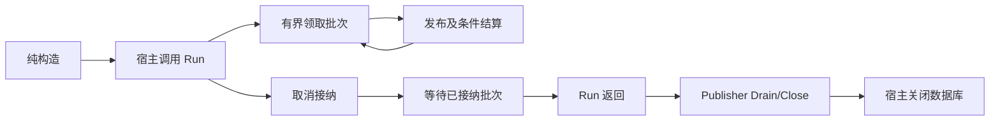

# 生命周期与恢复

本文回答何时启动 SDK 工作、谁关闭资源、超时如何处理，以及哪些重投仍需业务授权。范围为当前 Go/Python 运行对象；真实宿主停止预算和生产回退由宿主文档维护，SDK 不规定一个适合所有流的秒数。

宿主显式装配、启动、监督、停止 SDK。停止接纳不等于已排空，调用者返回也不等于底层 driver 已结束。数据库、借用 Producer 和共享事件循环必须等依赖它们的已接纳工作排空，或显式中断并核验底层已停止后再关闭；中断产生的未知结果仍保留在原持久记录中。

## 资源归属

| 对象 | 创建／启动行为 | 关闭责任 |
|---|---|---|
| Go Appender、Store、Relay.New | 验证／绑定；不建表、不开始后台循环 | 原事务／DB 由宿主；Relay.Run 由宿主启动和监督 |
| NSQ `New` 借用 Publisher | 不连接、不创建 Producer | Drain 后宿主停止借用 Producer |
| `NewManagedPublisher` | 明确创建 Producer 并连接/Ping；失败清理 | SDK Close 自持有 Producer；连接受 driver 超时限制 |
| NewSubscription／NewSubscriber | 验证配置；Subscribe 才开始网络工作 | Subscriber 关闭自持有 consumers／handoff；低层 binding 的连接由宿主 |
| Redis adapter | 构造不网络 I/O；Watch 持有自己的订阅 | 宿主 context／循环／Redis client；Watch 仅关闭自己的订阅 |
| Python PeriodicRelay | 构造不 create_task；await start 才启动 | stop/wait 由宿主；原池与 loop 仍由宿主 |
| Python NSQ 扩展 | 构造不连接；await start 启动 socket/timer | 停自己的读写器／timer，不关共享 loop 或借用 publisher map |

不能一概写“所有构造器无 I/O”。托管 Publisher 的名字和合同明确表示资源创建，返回前实际 Ping；其他纯绑定／配置入口不得隐藏启动工作。所有网络 driver 须配置有界 dial/read/write 行为。

## Go Relay 的监督与排空

Relay 每个实例只允许一个 Run。每批最多领取配置 concurrency 条，已接纳投递有独立 publish/write timeout。取消后停止接纳，等待已接纳批次结算；扫描错误返回宿主监督器，已领取行留待 lease 恢复。Observer 需同步、快速、不阻塞且并发安全，Go 不能强行终止不合作的 driver 或 callback。

Wake 是可丢失的提交后提示，周期扫描仍是权威。提示丢失、channel 关闭或进程重启不应取消持久扫描。Redis signaling 同样只缩短回查延迟，不能作为“已经持久接单”的记录。

## Publisher、Subscriber 的局部停止顺序

借用 Publisher 的顺序为：取消 Relay 接纳并等 Run 返回 → Drain 等实际 driver 调用 → 停宿主 Producer → 关 DB。ManagedPublisher 使用 Close 等排空并停自己的 Producer；Close 超时仍保留所有权，可再次 Close。需要强制中断时显式 Interrupt，再 Close 验证停止；中断中的 PUB 按 Unknown 保留，不把强制结束记为确认成功。

Subscriber.Close 先停止新注册，再等待连接、handler 和失败中转关闭。正在连接的 driver 调用可能晚于 Close deadline 结束；失败 Subscribe 也可能留下由原 subscriber 持有的部分资源。宿主应再次 Close 验证清理，不能丢弃实例后立即创建竞争订阅。DirectHandoff 同样保留超时后未完成的 stop 责任。

宿主有同时消费、发送和扫描的复杂拓扑时，应按依赖关系先停业务入口、再停各类新接纳，保留 handler 所需 DB／publisher，逐项验证关闭。上面的顺序是对象局部合同，不是 IAM/QS/AI 全系统回退操作单。容器停止 deadline 必须覆盖实际停止链，不能只取单个函数 timeout。

## Python 的同进程生命周期

PeriodicRelay 在宿主现有 loop 上 await start，notify 只是提示，wait/stop 暴露扫描错误。stop 停止接纳并等待当前 attempt；到期后协作取消、等待任务结束并抛出超时，原持久行仍供恢复。已有单进程监督／轮询循环的宿主可直接复用结算原语，不再运行第二套 Relay。

可选 NSQ 扩展在同一 asyncio loop 上管理 pynsq/Tornado 的 socket、heartbeat、reconnect 和 RDY timer。先启动 publisher，再启动 subscriber；停止 subscriber/新接纳后停止 publisher，最后关闭 DB 和宿主资源。不引入新事件循环、进程或线程。其显式 nsqd 拓扑不等价于 Go lookupd 发现。

## 故障恢复的三条边界

| 类型 | 恢复依据 | SDK 可做什么 |
|---|---|---|
| 未发布意图／过期租约 | 本地持久行和数据库时钟 | 原身份重投、栅栏拒绝迟到结算 |
| 已发布但无业务回执 | 回执型表、原业务身份和内容 hash | 按宿主预算重投原通知，等待认证回执 |
| 外部副作用／模型结果未知 | 宿主执行事实、原接单回执、冻结配置 | 不判断执行是否安全，不自动重建或重发业务调用 |

运输未知与模型调用未知必须分开。恢复已提交结果通知不等于重做模型调用；已接单任务、原 frozen config 和原执行身份仍由宿主保护。SDK RetryPolicy 选择技术延迟／隔离，不能授予业务重试权限。

## 原行重排与 ACK 补发

标准 MySQL `Appender.RequeueConfirmed` 仅作用于原 published 行。宿主先证明业务效果缺失、核对原不可变内容、授权并在同事务写审计；SDK 按 RecordID/version/fingerprint 条件重排，保留原 ID、bytes、计数及先前传输确认。RequestID 是审计关联，不是权限本身。未知返回应查原审批账本，不能把重复调用当作无条件成功。

回执型 `RearmAck/rearm_ack` 只重排 receipt-free final ACK。它保留原 wire 和失败计数，成功的重复 PUB 不消耗该 ACK 的失败预算；失败／未知 PUB 仍计数。已有 held 不被重复业务事件解除。需要回执的业务消息不能使用该入口，SDK 没有 ack-of-ack，也不自动 rearm 业务执行。

已确认标准行和 held/quarantined 行的处置、正文保留、密钥窗口及历史兼容由宿主治理。不能因队列空、容器健康或镜像可启动而删除未对账责任；回退前逐状态指定执行者并排除旧新写入者竞争。

## 失败窗口与取舍

| 故障 | 观察结果 | 恢复要求 |
|---|---|---|
| claim 后进程退出 | publishing 行保留 | 等数据库 lease 过期重新领取 |
| PUB 超时，driver 仍运行 | caller Unknown，slot 尚占用 | 保持有界并发，Drain 实际调用，接受可能重复 |
| 旧 claim 迟到回写 | ErrStaleClaim | 不覆盖新所有者，检查最终原行 |
| Close/stop 到期 | 关闭未完成或原结果未知 | 明确记录，后续验证关闭／原记录；不报告成功排空 |
| 丢 Wake/Redis 提示 | 无即时通知 | 周期扫描／宿主权威回查继续 |

显式所有权和排空需要更多宿主装配，但避免关闭 DB 时仍有暗中发送、双调度或无限超时任务。SDK 没有自动租约续期、通用进程管理或业务恢复引擎；超时参数、监督退避和部署回退须按真实宿主负载设计。

## 源码与验证

源码：[Relay](../../relay/relay.go)、[Publisher Drain](../../transport/nsq/publisher.go)、[ManagedPublisher](../../transport/nsq/managed_publisher.go)、[Subscriber](../../transport/nsq/subscriber.go)、[DirectHandoff](../../transport/nsq/handoff_transport.go)、[Redis adapter](../../signaling/redis/signaler.go)、[原行重排](../../storage/mysql/requeue.go)、[Python Relay](../../python/src/reliable_messaging/relay.py)、[Python NSQ](../../python/src/reliable_messaging/nsq.py)。

验证：[Relay 生命周期例子](../../examples/host-lifecycle/main.go)使用测试替身，不能证明 DB 持久性；[Relay 测试](../../relay/relay_test.go)、[崩溃恢复](../../tests/integration/crash_test.go)、[迟到执行者](../../tests/integration/late_relay_test.go)、[ManagedPublisher 实集成](../../transport/nsq/managed_publisher_integration_test.go)、[原行重排实库](../../tests/integration/mysql_requeue_test.go)、[ACK 持久预算](../../tests/integration/ackbudget/mysql_test.go)、[Python Relay](../../python/tests/test_relay.py)分别保护对应合同。
