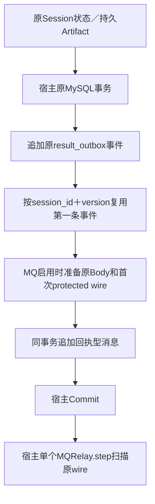

# Python 接入

Python 接入有两条合同，不能合成一个与 Go 标准 Store 完全对称的接口：0.1 核心绑定宿主原事务和已有 pending/delivered 表，0.2 增加可选 NSQ、protected wire 与回执型 Outbox。它们都保留宿主事务和单进程运行归属，但没有 Go 标准租约 Store 的跨进程领取与 fencing。

本篇先沿 qs-ai 的真实“状态已持久生成 → QS 接受原通知 → 原通知结算”链路解释 0.2，再给 0.1 原表配方。消息恢复只重投原通知，不重建任务、替换冻结配置或重做结果未知的模型调用。

## 安装的包与支持环境

分发名为 `fangcun-reliable-messaging`，导入名为 `reliable_messaging`，不依赖 Go runtime。当前源码要求 Python 3.11～3.13、SQLAlchemy 2.0 async；NSQ extra 固定 pynsq、Tornado 和 jwcrypto，详见 [pyproject.toml](../../python/pyproject.toml)。asyncmy 是当前验证的 MySQL driver，由宿主选择并安装，不是 SDK 自动创建的数据库连接。

开发当前源码可在 python 目录执行：

```sh
uv sync --locked --extra nsq
uv run --locked --extra nsq pytest -m 'not integration'
```

宿主使用经过核验的固定版本和制品，安装方式见 [Python README](../../python/README.md)。GitHub wheel／sdist 和摘要见[发布索引](../releases/README.md)；本地源码测试、wheel 测试和宿主依赖固定是三种证据，不能根据 pyproject 版本推断生产已经采用。

## qs-ai 实际怎样持久生成一条通知

固定源码 [bd5e18e](https://github.com/FangcunMount/qs-ai/tree/bd5e18ed4659d1d9d5ab853255577139df173aff) 已固定 Python 0.2.0a2；这是源码接入事实，不是本轮生产采集。

当 Session 状态更新时，[MySQLUnitOfWork.save](https://github.com/FangcunMount/qs-ai/blob/bd5e18ed4659d1d9d5ab853255577139df173aff/src/qs_ai/infrastructure/persistence/mysql/interpretation.py) 先更新 Session，再调用 stage_state：



[result_outbox](https://github.com/FangcunMount/qs-ai/blob/bd5e18ed4659d1d9d5ab853255577139df173aff/src/qs_ai/infrastructure/persistence/mysql/result_outbox.py) 的 session/version 唯一约束让重复状态保存复用第一条事件；COMPLETED 必须先有持久 Artifact。SDK bind(db).append 只是将宿主定义的 INSERT 放进原事务，未替宿主制定这些业务约束。

MQ recorder 读回已保存的原事件，准备确定的业务 Body 和首次 protected wire，交给宿主 MessagingStore.stage。该方法在同一事务 INSERT，锁定原行并核对原 Body、摘要和业务身份，重复身份不覆盖第一份 wire。自动编码、原结果匹配和冻结事实的检查都在宿主接缝，不是 SQLAlchemy appender 隐含完成的功能。

## PUB 后为什么仍为 awaiting_receipt

宿主 [MQRelay.step](https://github.com/FangcunMount/qs-ai/blob/bd5e18ed4659d1d9d5ab853255577139df173aff/src/qs_ai/infrastructure/workflow_transport/mq_relay.py) 使用进程内互斥门：

1. 在短读事务扫描最多20行，到期顺序由回执型 Store 约束。
2. 结束读 session，用保存的原 wire 发送 NSQ。
3. 打开另一笔宿主事务，根据结果调用 published、retry 或 hold。
4. 提交后等待原业务回执；到期仍可发送同一 wire。

只有结果同时为 CONFIRMED 和 BROKER，才调用 published。requires_receipt=true 的行从 staged 进入 awaiting_receipt，不能因 PUB OK 就变 confirmed；Rejected 的 hold、Unknown 的技术延迟由宿主策略决定。

这条循环没有 Go claim/token/lease，进程内门也不能推广为多进程保障。当前 qs-ai 保持单服务、单容器、单进程；若以后扩展多执行者，必须另设计领取和栅栏，不能仅增加容器副本。

```text
业务结果已经持久提交
→ 原消息 staged
→ PUB OK
→ awaiting_receipt
→ 收到 QS 已认证、匹配原身份／BodySHA 的 STORED 回执
→ 原消息 confirmed，并结算对应原 result_outbox
```

最后一步的结束点是“QS 已持久接受该通知”。它不自动证明报告已在小程序展示，也不授予模型再执行权限。

## 原业务 ACK 怎样与原结果原子结算

[CommandReceiver.receive_ack](https://github.com/FangcunMount/qs-ai/blob/bd5e18ed4659d1d9d5ab853255577139df173aff/src/qs_ai/infrastructure/workflow_transport/mq_receiver.py) 先认证原 wire、读取和校验原 Body，再开始宿主事务。confirm_event 校验原消息 kind、aggregate、摘要和对应结果记录；STORED 才 Confirm，并在同一事务标记对应 result_outbox delivered。

[MySQLDurableOutbox.confirm](../../python/src/reliable_messaging/durable.py) 自己只验证原行身份／BodySHA 和 requires_receipt，不负责验证 JOSE、业务 kind 或 STORED 的产品含义。不能让未经认证的外部 message_id 直接调用 confirm。

回执丢失会使原通知重投；QS 重复接收原事件时补发原 final ACK，qs-ai 继续按原事实结算。final ACK 是 receipt-free，不再要求 ACK 的 ACK。rearm_ack 保留原 wire 和失败预算，不能解除 held，也不能用于重发需要业务回执的模型命令。

## 0.1 原表接入：业务 INSERT 与意图 INSERT

没有采用上述 MQ 回执型表的宿主，可使用已有 pending/delivered 表。最小字段为：

| 字段 | 宿主应固定的含义 |
|---|---|
| event_id | 原通知身份，宿主提供唯一约束 |
| payload | 第一份通知正文；本文配方在其中同时保存 event_id |
| delivered | 已验证接收端持久接受 |
| attempts | 本地结算的失败／未知尝试 |
| available_at | 下一次可处理的数据库 UTC 时间 |
| delivered_at | 原通知接受结算时间 |

表、编码、重复键与冲突策略由宿主定义，MySQLPendingOutbox 不自动生成。以下片段在宿主原事务中保存一条合成结果；business_table 和 host_outbox 是宿主迁移创建的 SQLAlchemy Table：

```python
from sqlalchemy import insert
from reliable_messaging.sqlalchemy import bind

# 原 event_id、original_payload 在可能重入的事务之外固定。
async with db.begin():
    await db.execute(insert(business_table).values(id=event_id, status="completed"))
    await bind(db).append(
        insert(host_outbox).values(
            event_id=event_id,
            payload=original_payload,  # 包含原 event_id；不能只存临时队列定位。
            delivered=False, attempts=0, available_at=original_due,
        )
    )
```

bind 固定当前顶层事务和 savepoint；append 接受的是宿主定义的 Insert，不接受 Message、不建表、不自动算指纹或处理重复冲突。事务结束、被另一事务替换、进入不同 savepoint 都不能继续使用同一个 binding。

SQLAlchemy 的逻辑 begin 还不够。adapter 检查实际 MySQL driver 的 get_autocommit=false；非 MySQL、AUTOCOMMIT 或无法验证的 driver 会被拒绝。SDK 不 commit、rollback、close 或 dispose；append 失败／取消后宿主负责回滚。

若读操作已经 autobegin，就在其原 scope 绑定，或先结束该 scope 再进入新的宿主事务。不能先 pending(db)，再对同一个 session 无条件 db.begin()。

## 0.1 原表接入：读与结算分开

MySQLPendingOutbox.pending 返回 payload 列，而不是 Go Claim。下面用不同 session 分开读取与结算，避免 autobegin 冲突。接收端接口是合成宿主合同，实际适配必须认证响应并验证原 ID 的持久接受，不能相信任意返回值：

```python
from dataclasses import dataclass
from typing import Protocol
from sqlalchemy.ext.asyncio import AsyncSession, async_sessionmaker

from reliable_messaging import deliver_durable
from reliable_messaging.sqlalchemy import MySQLPendingOutbox


@dataclass(frozen=True)
class Receipt:
    event_id: str
    persisted: bool


class DurableReceiver(Protocol):
    # 宿主实现：在可信连接上调用并认证原事件的业务回执。
    async def accept(self, payload: dict) -> Receipt: ...


class Settlements:
    def __init__(self, sessions: async_sessionmaker[AsyncSession],
                 adapter: MySQLPendingOutbox) -> None:
        self.sessions, self.adapter = sessions, adapter

    async def delivered(self, event_id: str) -> None:
        async with self.sessions() as db:
            async with db.begin():
                await self.adapter.delivered(db, event_id)

    async def retry(self, event_id: str) -> None:
        async with self.sessions() as db:
            async with db.begin():
                await self.adapter.retry(db, event_id)


async def attempt(sessions: async_sessionmaker[AsyncSession],
                  adapter: MySQLPendingOutbox,
                  receiver: DurableReceiver) -> int:
    async with sessions() as db:
        async with db.begin():
            originals = await adapter.pending(db, limit=20)
    # 读事务已经结束；网络调用不占用这笔事务。
    settlements = Settlements(sessions, adapter)
    for original in originals:
        event_id = original["event_id"]

        async def verify_original() -> None:
            receipt = await receiver.accept(original)
            if not receipt.persisted or receipt.event_id != event_id:
                raise ValueError("original durable receipt not verified")

        await deliver_durable(event_id, settlements, verify_original)
    return len(originals)
```

这个配方是单进程、顺序处理，不带领取锁或跨进程 fencing。接收端必须重复安全；同一原通知重投仍查回原业务结果。表若没有 payload 内 event_id，宿主应提供自己的读取适配，不应假设 SDK 会把表键自动加入 payload。

deliver_durable 的三种结算区别：

| 事件 | 行为 |
|---|---|
| verify_original 正常返回 | 调用 store.delivered，持久接受后结算 |
| verify_original 异常／超时 | 调用 store.retry，返回 Unknown |
| 显式 DeliveryRejected | 同样 retry，返回 Rejected；原表不自动 hold |
| callback 返回 Broker DeliveryResult | 拒绝将其当持久回执，retry |
| 取消 | 传播取消，不结算未知业务结果 |
| delivered／retry 持久写入失败 | 错误向宿主监督传播，不伪装为接收端拒绝 |

SDK 不检查 HTTP/gRPC 响应内容；verify_original 的真实性由宿主实现。其结果通知已提交，才有“重投原通知”的前提，不能由这个函数触发新模型调用。

## 可选 NSQ 怎样装配进现有 loop

```python
from reliable_messaging.nsq import NSQPublisher

publisher = NSQPublisher("127.0.0.1:4150", timeout=5, max_in_flight=4)
await publisher.start()  # 显式连接，构造无 I/O。
try:
    result = await publisher.publish("example.events", original_wire)
    # 保留原 wire，根据 result.outcome 与 confirmation 结算原行。
finally:
    await publisher.stop(grace_seconds=10)
```

NSQSubscriber 需要 topic/channel、按真实来源地址映射的 borrowed publishers，以及 handler、failed_handler、invalid_handler、failure_ready。准备各来源节点的持久业务／失败 channel，启动 Publisher，再启动 Subscriber。

handler 提交业务／Inbox／回执意图后返回，才 FIN；failed_handler 持久保存中转，invalid_handler 持久隔离非法原 wire，取消不 FIN。它只支持显式 nsqd，不提供 Go lookupd 动态发现或临时 channel；所有对象使用宿主同一个 asyncio/Tornado loop。

Publish 超时保留真实 callback 的 in-flight slot。stop 先等待预算，再关闭自己的 client；未确认发送仍是 Unknown。不能另调 nsq.run、新建 loop、进程或线程来完成接入。详见[投递与消费](../01-核心设计/投递与消费.md)和[生命周期与恢复](../01-核心设计/生命周期与恢复.md)。

## 是否需要 PeriodicRelay

已有调度循环时继续用一个宿主 step。qs-ai 当前 bootstrap 装配 MQRelay 并把 step 交给已有调度器，未使用 PeriodicRelay 或 deliver_durable 作为其 MQ 路径。

没有扫描循环的简单宿主可以显式使用 PeriodicRelay(attempt, poll_seconds=1, shutdown_seconds=5)，await start 后监督 wait，退出时 stop。它只调用宿主 attempt，不新增持久表、领取机制或无限重启监督。notify 丢失仍靠周期扫描。

停止预算是合作取消：不合作的 callback 可能拖住 stop，不能据此提前关数据库。单进程结构、原接单任务、未知供应商结果和原冻结配置恢复仍由 qs-ai 原执行与恢复模块负责。

## 接入后的证据要分开取得

| 要证明的关系 | 实际验证入口 |
|---|---|
| 原事务、savepoint 与真实 autocommit | [MySQL tests](../../python/tests/test_mysql.py) |
| 接单回执先于 delivered，Broker 不能冒充 | [delivery tests](../../python/tests/test_delivery.py) |
| 原 wire、awaiting_receipt、迟到结算不覆盖 confirmed | [durable MySQL tests](../../python/tests/test_durable_mysql.py) |
| 真实 NSQ 在持久屏障前不 FIN | [NSQ integration](../../python/tests/test_nsq_integration.py) |
| qs-ai 业务＋Inbox＋回执共同提交／回滚 | [宿主 storage integration](https://github.com/FangcunMount/qs-ai/blob/bd5e18ed4659d1d9d5ab853255577139df173aff/tests/integration/test_mq_storage.py) |
| 原结果与原 ACK 同事务结算 | [宿主 admission integration](https://github.com/FangcunMount/qs-ai/blob/bd5e18ed4659d1d9d5ab853255577139df173aff/tests/integration/test_mq_admission.py) |
| 未就绪不发消息，不增加第二调度器 | [宿主 runtime tests](https://github.com/FangcunMount/qs-ai/blob/bd5e18ed4659d1d9d5ab853255577139df173aff/tests/test_messaging_runtime.py) |

默认单测、一次性资源集成、installed wheel、宿主部署与业务验收是不同层。真实模型调用不属于 SDK 隔离测试；需要的冻结配置与未知结果保护必须保留宿主证据。
