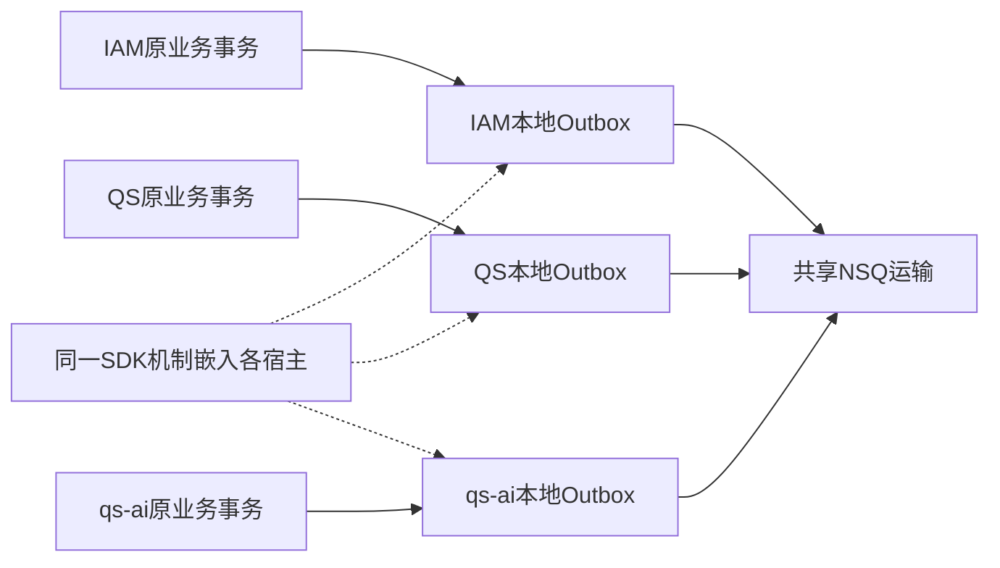
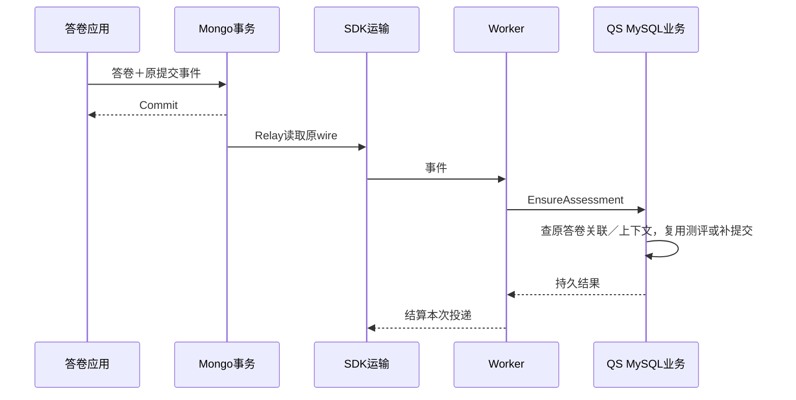

# 宿主接入边界

reliable-messaging 聚合可复用的消息机制，IAM、qs-server、qs-ai 保留判断业务事实与执行许可的代码。目标是删除重复的领取、运输、结算和通用编码算法；不是把每段含“消息”两个字的业务代码全部搬进 SDK。

本文从三个宿主的实际调用链说明哪些已委托 SDK、哪些仍应留在宿主、哪些只是后续抽取候选。固定源码基线为 IAM c8fc1fe、QS 2ccc2de、qs-ai bd5e18e；源码依赖和装配不能直接证明今天的生产实例已部署或业务已验收。

## 原业务库为什么仍有本地消息记录

独立代码库不等于独立部署的中央消息服务。业务事务在 IAM MySQL、QS MySQL／Mongo 或 qs-ai MySQL 中提交，相应的发布意图必须在同一个原子边界中保存。



把意图改存中央数据库，反而产生“业务库提交＋中央库写入”的新双写边界。SDK 没有自己的 MySQL、Redis 或 MongoDB；它借用宿主池，或在明确的 ManagedPublisher API 下拥有专用 Broker 连接。

## 怎么区分通用机制和业务规则

| 判断问题 | SDK 可以统一的部分 | 宿主不可省略的部分 |
|---|---|---|
| 如何追加原意图 | 原事务绑定、标准指纹冲突、存储原语 | 哪笔业务事务、事件内容、失败回滚 |
| 如何发出去 | 领取栅栏、发布结果、NSQ 连接与失败中转 | 路由配置、节点清单、可靠性选择 |
| 何时结束 | PUB／FIN／回执的明确合同 | 接单、报告完成、权限失效等业务定义 |
| 如何处理重复 | 原 ID／原 bytes 保持、条件结算 | 业务唯一关联、原结果查询和副作用许可 |
| 如何恢复 | 原租约重投、最终 ACK 重排、原行条件重排 | 缺失效果证明、审批、未知外部调用治理 |
| 如何运行 | Run/Start/Subscribe/Drain/Close 对象合同 | 服务组合根、监督、退出预算、池所有权 |

例如“按 token/version 拒绝迟到领取结算”可以统一；“这份报告不存在，因此可按原授权重试模型”依赖 QS/qs-ai 业务事实，不能抽成 Broker 通用逻辑。

## IAM：一次授权修改的责任链

以角色或 Assignment 修改为例，原命令在宿主 UoW 中完成：

```text
IAM业务命令
→ 修改授权事实
→ 递增PolicyVersion
→ StageVersionChanged
→ SDK BindGORM＋Append
→ IAM Commit
→ 本实例重载
→ 宿主监督的SDK Relay发布版本提示
```

[CreateRole](https://github.com/FangcunMount/iam/blob/c8fc1fe61a32056368148e232e96d32763c15ba5/internal/apiserver/application/authz/role/command_service.go) 负责“角色是什么、改动是否合法、版本为何增加”。[StandardStager](https://github.com/FangcunMount/iam/blob/c8fc1fe61a32056368148e232e96d32763c15ba5/internal/apiserver/infra/mysql/eventoutbox/standard_stager.go) 从 context 取得原 GORM tx，验证 PolicyVersion 与 payload，然后交给 SDK。

IAM 保存原版本正文；[PolicyWirePublisher](https://github.com/FangcunMount/iam/blob/c8fc1fe61a32056368148e232e96d32763c15ba5/internal/apiserver/infra/messaging/policy_wire_publisher.go) 在运输边界确定性编码 Revision1，不覆盖原指纹所对应的正文。不能把它描述为 QS／AI 的“首次加密完整 wire 入库”。

[平台装配](https://github.com/FangcunMount/iam/blob/c8fc1fe61a32056368148e232e96d32763c15ba5/internal/apiserver/container/platform/reliable_eventing.go) 检查 schema／旧链路排空、提供路由和 RetryPolicy，装配 SDK Store、Relay、ManagedPublisher。[ReliableRuntime](https://github.com/FangcunMount/iam/blob/c8fc1fe61a32056368148e232e96d32763c15ba5/internal/apiserver/infra/messaging/reliable_runtime.go) 串行监督 Run，停止时 join 再排空真实发送。

SDK 在这个显式 API 下拥有专用 Producer，IAM 仍拥有整个进程启动／退出和数据库。IAM 的角色、门店范围、权威版本、撤权时限和安全失败方向仍应在 IAM／消费宿主文档维护，不能在 SDK 设置成所有系统共同的业务政策。

## QS：Mongo 提交与 MySQL 接单有独立事务边界

QS 答卷可能先在 Mongo 事务提交，再由 Worker 请求 API 在 MySQL 建立测评并提交评估意图：



这是两个数据库的本地事务边界，SDK 没有把它们变成 MySQL/Mongo 分布式事务；MySQL 创建测评与 pending 补提交也可能各自提交，不能理解为整条链总计只有两笔事务。接入标准表减少重复运输机制，仍需用业务关联识别跨库缺口。

[Mongo Stager](https://github.com/FangcunMount/qs-server/blob/2ccc2de44bbd45e26d29e7e130da518cc32426f0/internal/apiserver/infra/mongo/standardoutbox/stager.go) 绑定 SessionContext；[MySQL Stager](https://github.com/FangcunMount/qs-server/blob/2ccc2de44bbd45e26d29e7e130da518cc32426f0/internal/apiserver/infra/mysql/standardoutbox/stager.go) 绑定原 GORM tx。Mongo callback 重入、snapshot/majority、背压和共享资源仍由宿主事务 runner 控制。

MySQL Stager 对 EvaluationRequested 额外保存原评估关联证据。这份业务索引帮助恢复时由 Assessment 找到原事件，不是再实现一份 SDK Outbox；删除它会失去安全恢复原身份的依据。

[SDKDeliverySubscriber](https://github.com/FangcunMount/qs-server/blob/2ccc2de44bbd45e26d29e7e130da518cc32426f0/internal/pkg/eventing/transport/sdk_delivery_subscriber.go) 已把 NSQ 物理重试、结算和终端中转交给 SDK。QS 提供持久失败审计及进程生命周期桥接；[Worker](https://github.com/FangcunMount/qs-server/blob/2ccc2de44bbd45e26d29e7e130da518cc32426f0/internal/worker/handlers/answersheet_handler.go) 和 [Assessment Intake](https://github.com/FangcunMount/qs-server/blob/2ccc2de44bbd45e26d29e7e130da518cc32426f0/internal/apiserver/application/journey/assessmentintake/service.go) 保留业务幂等。

## 为什么 QS 的扫描和恢复不能整体搬走

标准 Store 的 published 只证明 PUB 已确认，不证明报告结果存在。QS 的[答卷效果缺口扫描](https://github.com/FangcunMount/qs-server/blob/2ccc2de44bbd45e26d29e7e130da518cc32426f0/internal/apiserver/infra/answersheetgap/scanner.go) 核对答卷到 Assessment、原 Outbox 与冻结准入关联，不负责报告或未知模型执行核验。更完整的宿主恢复治理需要按各业务事实分别区别：

- 业务根本未提交，不能补消息冒充提交。
- 原事件已确认但效果确实缺失，可形成审核的原行恢复计划。
- 任务已接单或外部调用结果未知，应保留原执行身份和人工治理。
- 效果已经存在，仅消息回执／提示丢失，不应重做业务。

SDK 的 RequeueConfirmed 只是执行其中经授权的条件更新，不承担扫描判定。Task 主动提醒的 SELF 收件人、有效期、完成／取消抑制和微信结果未知也属于 QS 产品合同，不适合写入一个所有服务通用的重试函数。

## qs-ai：持久接单不能简化为收到命令

qs-ai 的[组合根](https://github.com/FangcunMount/qs-ai/blob/bd5e18ed4659d1d9d5ab853255577139df173aff/src/qs_ai/bootstrap/messaging.py) 读取宿主密钥、借用应用数据库、检查 schema、创建预配置 mTLS stub，并显式启动 Publisher／Subscriber，未建立另一个数据库或独立调度服务。

命令接收链为：

```text
原wire认证＋正文核验
→ 宿主原事务reserve原命令
→ 重复命令复用原决定；新命令才执行准入与原任务／冻结配置检查
→ 同事务持久Inbox决定＋首次业务回执意图
→ 宿主Commit
→ 才允许FIN
→ 原执行调度继续
```

[CommandReceiver](https://github.com/FangcunMount/qs-ai/blob/bd5e18ed4659d1d9d5ab853255577139df173aff/src/qs_ai/infrastructure/workflow_transport/mq_receiver.py) 与 [MessagingStore](https://github.com/FangcunMount/qs-ai/blob/bd5e18ed4659d1d9d5ab853255577139df173aff/src/qs_ai/infrastructure/persistence/mysql/messaging.py) 定义这些业务事实；SDK MySQLDurableOutbox 提供原事务里的 published/retry/confirm/hold 等原语。

[MQRelay.step](https://github.com/FangcunMount/qs-ai/blob/bd5e18ed4659d1d9d5ab853255577139df173aff/src/qs_ai/infrastructure/workflow_transport/mq_relay.py) 由现有单进程调度器调用。它没有 Go 标准租约领取，不能据此扩成多个进程竞争同一批任务。

LangChain／LangGraph 的执行图、Checkpoint、模型容量、候选配置、provider_result_unknown、已接单恢复及原授权重试仍由原执行／恢复模块维护。PUB 超时、消息重投、ACK 丢失都不能自动授权重新调用供应商。

## 命令、事件和最终 ACK 怎样避免无限回执

QS／qs-ai 的消息族有不同终点：

| 流 | 谁持久接受 | 发送端结算依据 |
|---|---|---|
| QS命令 → qs-ai | 原任务准入决定与接单回执 | 经认证的原命令业务回执 |
| qs-ai事件／回执 → QS | 原事件处理与对应原业务事实 | QS对原事件的最终ACK |
| QS最终ACK → qs-ai | 核验原事件并结算原结果通知 | receipt-free，PUB确认结束，不再发ACK的ACK |

SDK 统一回执型状态操作，却不定义 protobuf kind、STORED 的业务含义或哪个阶段等于报告完成。具体的有限回执链和原结果原子结算由双方宿主实现，见[Python接入](Python接入.md)。

## 宿主代码增加是否意味着抽取失败

接入期间常同时增加三类代码：

1. **必须保留的业务保护**：原评估关联、权限权威回查、冻结任务、效果扫描与恢复授权。
2. **可以共用的接缝**：通用目录索引、生命周期桥接、失败审计存储、原正文引用验证的一部分。
3. **应被退役的旧机制**：已经由 SDK 替代的运输、领取和重复结算算法。

行数增加本身不能区分它们，但抽取完成后仍让旧新两套算法运行，也不能称为收敛。应按责任链查实现，再将通用机制及测试移动到 SDK，并删除对应重复实现；宿主保留薄适配和业务规则。

当前可评估的候选包括：

| 候选 | 已核代码事实 | 抽取时必须守住的边界 |
|---|---|---|
| 通用 Catalog 校验 | QS已别名SDK；IAM仍有自己的目录实现 | 事件定义与宿主公开兼容留本地 |
| 有界运行桥接 | IAM ReliableRuntime、QS SDK wrapper重复部分装配 | 不接管整个服务监督器，不关借用池 |
| 原正文引用校验 | QS／AI都有原行读取和hash/length核验 | protobuf、组织准入、证书身份仍归宿主 |
| 失败审计存储 | SDK中转后宿主仍保存持久审计 | 不把业务hold、逻辑预算和修复审批混入通用表 |

这些是分析候选，不是本次文档重写新批准的开发计划。没有证据支持把所有 Worker、恢复脚本或模型执行状态整体转移到 SDK。

## 怎样证明宿主真正完成接入

宿主交付记录应将同一原消息串起来：

```text
原业务事务／唯一键
→ 原意图与字节
→ 领取／发布证据
→ 消费端权威幂等事实
→ 回执或效果
→ 失败与恢复责任
→ 真实停止／回退证据
```

记录实际部署版本、Store/路由范围、采集时刻和明确结束点；无法绑定的当前状态写 unknown。SDK 默认测试、绿色 CI、合并 main、健康容器和真实业务验收分别说明，不互相替代。

宿主业务政策不复制到 SDK 的通用正文；持续变化的生产镜像、积压水位、验收百分比和负责人留在宿主版本化发布／运维记录。本文负责解释可定位的责任边界。
