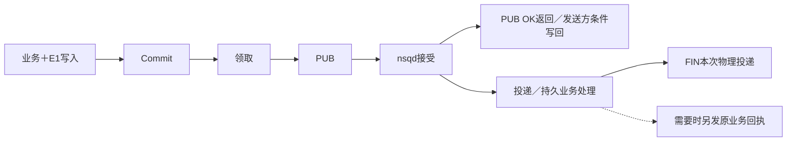

# 测试与故障验证

可靠消息测试应让原意图 E1 穿过真实事务、发布、确认和消费窗口，再检查原行、原 bytes 与效果。只断言函数返回成功，无法证明提交后可恢复，也无法排除重复业务副作用。

本文回答该运行哪个入口、故障实际发生在哪一段、绿色结果能说明什么。命令是当前验证入口，不代表每次阅读时已经执行；具体 tag 的已执行证据见[发布索引](../releases/README.md)。

## 按改动选择入口

| 目的 | 入口 | 实际覆盖与依赖 |
|---|---|---|
| 文档内容／导航 | `make docs-check` | 标准库离线链接、锚点、围栏、少量源码事实和归档摘要 |
| Go常规机制回归 | `make check`，另行 `make lint` | docs、格式、vet、默认测试、race；lint是独立目标 |
| Go原事务与真实Store/Broker | `make integration` | 一次性MySQL／Mongo replica set／NSQ／lookupd及进程故障 |
| 定位NSQ消费与中转 | `make subscription-integration` | 订阅专项，不能代替双库验证 |
| Redis提示适配 | redis_integration标签 | 专用Redis；验证互通、非法输入、取消清理与借用client归属 |
| Python快速合同检查 | 排除integration的pytest | 不访问标记的集成数据库；跨语言合同仍可能需要Go |
| Python完整合同／发布候选 | Python workflow规定的矩阵和制品流程 | 实库、NSQ、源码测试、安装wheel后重跑 |

make check 不执行 lint、integration、redis_integration 或 Python SDK 测试。默认 go test 通过，不能据此声称数据库原事务和真实 NSQ 已验证。

文档检查不编译 Markdown 代码块、不渲染 Mermaid、不访问远端链接或核验生产，也不评价正文是否正确解释业务。绿灯只是结构门槛；示例和语义仍需独立复核。

## 常规命令

从仓库根运行：

```sh
make docs-check
make check
make lint
```

lint 安装固定版本工具，可能需要获取依赖；完整集成入口还可能获取缺失的历史tag，因此不能称整个验证过程离线。

Python在 python 目录运行：

```sh
uv sync --locked --extra nsq
uv run --locked --extra nsq ruff check src tests
uv run --locked --extra nsq ruff format --check src tests
uv run --locked --extra nsq mypy src
uv run --locked --extra nsq pytest -q -m 'not integration'
```

若改变身份／wire，还要查看 [golden fixtures](../../contracts/fixtures/identity-vectors.json)、[历史兼容](../../tests/compatibility/)和[架构依赖](../../tests/architecture/)的具体断言，不仅依赖总测试数。

## 一条 E1 应怎样注入故障

正常链首先明确：原事务保存业务和 E1，提交后 Relay 领取并 PUB；消费者按原身份持久处理，提交后 FIN。然后沿边界打断：



| 注入点 | 必须观察什么 | 对应真实验证 |
|---|---|---|
| 事务提交前退出／回滚 | 业务和意图共同消失，不能残留单边成功 | MySQL/GORM/Mongo原事务，Python事务进程用例 |
| Commit后，提示丢失 | 周期扫描仍发现原 E1 | Relay轮询与Python重启扫描 |
| Claim后、PUB前杀进程 | 原行留在publishing，租约到期可恢复 | [crash tests](../../tests/integration/crash_test.go) |
| NSQ接受、写回前杀进程 | 再投仍是原E1/wire，可出现第二物理消息 | 同一进程故障测试与真实NSQ |
| 丢实际PUB回复 | Unknown而非Confirmed，重投保持原bytes | [NSQ发布测试](../../tests/integration/nsq_test.go) |
| 数据库拒绝Confirm | 原行未结算，租约恢复后继续 | [MySQL tests](../../tests/integration/mysql_test.go)的trigger场景 |
| 旧领取迟到 | token/version拒绝旧写回 | [late relay](../../tests/integration/late_relay_test.go) |

发送方写回与消费可以并行，消费者可能先于 Store.Confirm 完成；测试不能把两者当作严格串行屏障。最后两项使用真实数据库，但部分 Publisher 是受控替身。trigger场景证明数据库写回失败，不是证明真实 Broker 断开；迟到Publisher证明领取栅栏，不是所有不合作 callback 都能按时关闭。

crash fixture 用自己 effects 表的主键得到一次效果。它只证明这个合成消费者幂等，不能代替 IAM权限缓存、QS答卷关联或qs-ai原执行事实。

## 真实双库与 NSQ 入口

```sh
make integration
make subscription-integration
```

[完整脚本](../../scripts/integration.sh)使用一次性 Compose 项目，执行原事务、八组时区、混合状态公平领取、独立进程崩溃、迟到写回、原行重排、owned Publisher、固定旧新版本交接及 Broker 重启。

[订阅专项](../../scripts/nsq-subscription-integration.sh)聚焦：

- 显式地址／lookupd、首次PUB前channel准备。
- 中转在真实来源nsqd准备、丢确认与连接中断。
- 失败审计missing-table时REQ，恢复数据库后持久保存。
- 审计进程退出后原失败消息恢复。
- 临时实例替换、新节点加入与重连。

同样应核两次FIN：原业务FIN只等中转PUB确认，失败消息FIN才等审计提交。测试不能把它们合成“原消息结束前业务账本一定已保存”。

精确范围以当前脚本／探针为准。旧过程说明可能仍写“没有并发旧新Relay证据”，但当前脚本已有 parallel-claim、relay-parallel-run 和丢PUB确认交接，不能照搬旧结论。

## 隔离保护只在明确入口成立

两个 Go 脚本拒绝 DOCKER_HOST 覆盖和非 unix:// Docker endpoint，使用随机项目、固定本轮内部地址、一次性数据库与本轮volume。需要可用Docker和支持 up --wait 的Compose；缺依赖就失败，不能将未执行当通过。

但直接运行 `go test -tags integration` 的多项 fixture，以及 Python 的 MySQL fixture，仅检查测试地址非空，会建表／删表／写数据，**没有通用的生产数据库识别保护**。不得给它们业务 DSN；优先使用既有隔离入口或逐项核对一次性资源。

普通退出和中断有trap清理，脚本或主机SIGKILL仍可留下项目。清理只针对本轮名称／标签，不能用全局docker prune代替。Python Broker强杀测试建立自己随机名称和唯一label的容器，kill前核对身份，不杀配置的共享Broker。

订阅专项允许 RM_TEST_RUN 缩小测试集合；合法但没有匹配到测试的pattern可能返回成功，因此还应确认目标测试实际出现，不仅看退出码。

## 两种“成功复现问题”的测试

### NSQ PUB确认后内存消息丢失

Go Broker探针先在专用volume里验证正常stop/start恢复10条原消息，再用独立topic确认消息只在内存，SIGKILL要求退出137，观察10条已确认消息消失。

```text
实验预期：复现内存消息的强杀丢失窗口
实验实际：已确认消息确实消失
结果：表征成功（OBSERVED LIMIT）
不能写成：强杀后消息可靠恢复通过
```

标准Store不自动扫描published补发，故这个结果需要回执或宿主效果核验设计，而不是把测试改成“重发全部published”。

Python的[回执型恢复测试](../../python/tests/test_durable_mysql.py)则因为行仍awaiting_receipt，可复用原wire恢复运输，通过fixture幂等表识别一次效果；最后由fixture显式confirm。它不是自动收到真实qs-ai的认证回执，两个实验的结束点不同。

### 旧版不维护新增失败预算

固定v0.1.0／v0.2.1二进制的双库试验覆盖普通行、租约、并行发送和确认丢失，也刻意观察旧Store不增加failure_count、旧Mongo文档缺created_at。

实验成功复现这些缺口，就可以通过。它证明降级限制真实存在，不能证明所有业务状态可安全回退。详细交接见[兼容与升级](兼容与升级.md)。

## final ACK 和跨语言应另验证

receipt-free final ACK 成功PUB可以多次发生，但 Published 不增加 attempts；Unknown／失败经 Retry 结算增加，Hold 本身不增加，held不能因重复事件解除。该合同由 [Go真实预算测试](../../tests/integration/ackbudget/mysql_test.go)和 [Python durable tests](../../python/tests/test_durable_mysql.py)验证。

Go ACK预算子包由Python workflow专门执行，不在make integration编译的主测试包中；对应命令为 `go test -count=1 -race -tags=integration ./tests/integration/ackbudget`，仍需本轮专用 RM_MQ_DURABLE_TEST_DSN。

protected跨语言测试核对认证、路由、密钥轮换和尺寸；同一个明文的随机密文不要求字节相同。正文引用及mTLS、组织／原任务准入仍需宿主测试，不能由纯codec用例代签。

## 三个 CI 工作流不是一个总绿灯

| 工作流 | 当前触发与执行范围 |
|---|---|
| [ci.yml](../../.github/workflows/ci.yml) | 所有push／PR；docs、Go1.25.9最低工具链、Go1.25.12常规＋lint、真实Redis |
| [integration.yml](../../.github/workflows/integration.yml) | 所有push／PR；Ubuntu24.04上make integration，10分钟job上限 |
| [python.yml](../../.github/workflows/python.yml) | push有分支和路径过滤，PR有路径过滤；纯文档PR不保证触发 |

最低Go job设置 GOTOOLCHAIN=local，防止自动换高版本掩盖兼容问题。Python矩阵为3.11/MySQL8.0.36/Go1.25.9和3.13/MySQL8.4/Go1.25.12，配一次性NSQ1.3.0。

Python显式checkout PR head；其他工作流可使用默认PR merge ref。执行记录应保存实际checkout源码，不把两个不同SHA上的绿灯合成同一源码证明。

## Python完整测试与 wheel 证明

完整测试按workflow准备专用 RM_M7_MYSQL_URL、RM_MQ_NSQ_TCP、RM_MQ_NSQ_HTTP，Go ACK预算另用 RM_MQ_DURABLE_TEST_DSN。这些地址必须属于本轮一次性资源，不能从宿主环境直接复用。

workflow先执行Go ACK实库测试，再运行Python完整测试，要求报告非空、零失败／错误／跳过，且目标预算测试确实出现。然后构建wheel，安装到独立环境：

```text
源码测试
→ wheel/sdist构建
→ 独立环境安装wheel
→ 版本、py.typed、构造无连接检查
→ 离开源码再次执行必需测试
→ 保存源码SHA/tree、制品SHA-256与非空报告
```

artifact-review明确是候选、formally_published=false。uv build或上传CI artifact不等于GitHub Release／PyPI发布，也不证明qs-ai已经采用。installed-wheel测试可以反证源码路径掩盖打包缺失，但不能替代生产业务验收。

## Redis提示测试怎样运行

```sh
RM_SIGNAL_REDIS_ADDR=127.0.0.1:6379 go test -race -count=1 -tags redis_integration ./signaling/redis
```

地址必须是专用Redis。当前用例验证冻结JSON双向互通、坏JSON后继续、Watch取消／订阅清理、借用client仍可用及无订阅发布，没有注入Redis网络中断／重连。它不证明Outbox必达或权限失效时限；持久扫描、TTL和权威回查属于宿主证据。

## 一份可用验证记录应写什么

记录精确源码／tag、实际checkout tree、依赖版本或镜像摘要、参数、实际测试集合、退出码与非空报告、原行前后状态、原wire／安全摘要和本轮资源归属。替身写清代替哪一段，故障命名绑定真实触发点。

SDK验收结束于其明确合同：真实事务、运输、栅栏、回执原语和资源退出。宿主仍需证明具体幂等、冻结配置、未知外部结果保护、真实部署与产品完成点；当前CI绿色不能替所有业务或所有版本出具结论。

现场采集和定位方法见[观测与故障处置](观测与故障处置.md)。
